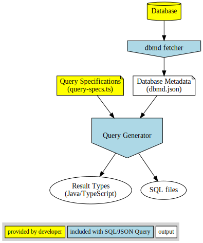
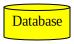
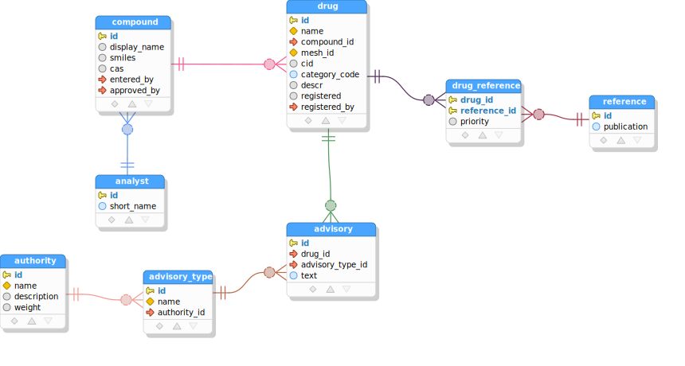
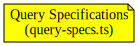
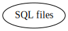
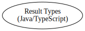

# SQL/JSON-Query

## Overview

This tool generates SQL queries to fetch nested data in JSON format from any number of related database tables,
and generates result type declarations that match each query's result structure. The generated SQL can then be
executed directly against the database without the need for any extra runtime libraries, yielding JSON, and the
results deserialized to the generated result types using any of the common libraries or facilities in your target
language for that purpose (e.g. Jackson for Java, or just JSON.parse() for TypeScript).

- Supported databases: **PostgreSQL**, **MySQL**, **Oracle**.

- Supported languages for result types: **TypeScript**, **Java**

## Process



For each of a set of TypeScript *query specifications* written by the developer, which describes a hierarchy of
related tables from which to fetch data, the tool:
 - Generates a SQL query conforming to the [ISO SQL/JSON standard](https://www.iso.org/standard/78937.html),
   or the closest approximation supported by the database, which when executed will yield JSON data for the
   related tables via a single query execution.
 - Generates the matching type declarations for the query results in either TypeScript or Java, to which the
   query results can be directly deserialized.

An advantage of using SQL/JSON aggregation functions, as found in the generated queries, is that it allows us to
efficiently pull data from multiple independent child hierarchies of any given parent table in a single query,
which is not achievable practically or efficiently via traditional joins. The downside of SQL/JSON is that it's
somewhat difficult and tedious to actually write these queries directly in SQL, and more so to also create types
to match the query result structures. This was the motivation for the source generator: to make it easy to create
the nested data SQL/JSON queries from a simple specification and to auto-generate their result types at the same
time.

When generating queries, database metadata is used to verify all tables, fields, and foreign key relationships
referenced in the query specifications, failing with an error if any such items are not found in database metadata.
A self-contained tool is included to fetch the database metadata for each supported database.

As a developer, your primary job in the process is to supply a file `query-specs.ts` which provides a list of query
specifications, where each specification describes a hierarchy of data to be fetched for a query. An example of the
query specifications and generated sources follows.


## Example Inputs and Outputs

Let's look at example inputs and outputs to clarify what the tool does. For an actual follow-along executable example,
please see the [the tutorial](tutorial.md).


### Inputs

Out first "input" is the database itself, for which we'll use the example schema diagrammed below (which is about
clinical drugs). The database is used to generate database metadata in JSON form, which is needed by the tool
during source generation, both to verify references to database objects and to find foreign key information
for related tables in query specifications. Generally we would only generate database metadata initially and then
whenever the database has changes that we want to incorporate into our queries.






The other input for the source generator is a set of query specifications. A query specification describes how
to form JSON output for each table, including how related table data is nested via parent/child table
relationships within a table's output. These query specifications are expressed in TypeScript, regardless of
target language, and are checked against database metadata whenever the tool is run. This checking ensures
validity of all references to database objects, including implicit reliance on foreign keys in parent/child
relationships. 

In this example we supply a specification for a single drugs query, which fetches data from all tables in the above
diagram:

```typescript
const drugAdvisoriesReferencesQuery: QuerySpec = {
  queryName: 'drug advisories references query',
  tableJson: {
    table: 'drug',
    recordCondition: { sql: 'category_code = :catCode' },
    fieldExpressions: [
      { field: 'name', jsonProperty: 'drugName' },
      'category_code',
    ],
    parentTables: [
      {
        referenceName: 'primaryCompound',
        table: 'compound',
        fieldExpressions: [
          { field: 'id', jsonProperty: 'compoundId' },
          { field: 'display_name', jsonProperty: 'compoundDisplayName' },
        ],
        parentTables: [
          {
            table: 'analyst',
            fieldExpressions: [
              { field: 'short_name', jsonProperty: 'enteredByAnalyst' }
            ],
            viaForeignKeyFields: ['entered_by'] // <- specified because there are two foreign keys to this parent
          },
        ]
      },
    ],
    childTables: [
      {
        collectionName: 'advisories',
        table: 'advisory',
        fieldExpressions: [
          'advisory_type_id',
          { field: 'text', jsonProperty: 'advisoryText' },
        ],
        parentTables: [
          {
            table: 'advisory_type',
            fieldExpressions: [ { field: 'name', jsonProperty: 'advisoryTypeName' } ],
            parentTables: [
              {
                table: 'authority',
                fieldExpressions: [ { field: 'name', jsonProperty: 'advisoryTypeAuthorityName' } ]
              }
            ]
          }
        ]
      },
      {
        collectionName: 'prioritizedReferences',
        table: 'drug_reference',
        fieldExpressions: [ 'priority' ],
        parentTables: [
          {
            table: "reference",
            fieldExpressions: [ 'publication' ]
          }
        ],
        orderBy: 'priority asc'
      }
    ]
  }
};
```

### Outputs
Given the inputs above, SQL/JSON-Query produces the following outputs:

1)  SQL files are generated and written to a
specified output directory, for each query specification that was supplied. The SQL utilizes ISO standard SQL/JSON
operators or their closest equivalent for the chosen type of database. For the query specification above the following
SQL is produced.

```sql
select
  -- row object for table 'drug'
  jsonb_build_object(
    'drugName', q."drugName",
    'categoryCode', q."categoryCode",
    'primaryCompound', q."primaryCompound",
    'advisories', q.advisories,
    'prioritizedReferences', q."prioritizedReferences"
  ) json
from (
  -- base query for table 'drug'
  select
    d.name "drugName",
    d.category_code "categoryCode",
    -- parent table 'compound' referenced as 'primaryCompound'
    (
      select
        -- row object for table 'compound'
        jsonb_build_object(
          'compoundId', q."compoundId",
          'compoundDisplayName', q."compoundDisplayName",
          'enteredByAnalyst', q."enteredByAnalyst"
        ) json
      from (
        -- base query for table 'compound'
        select
          c.id "compoundId",
          c.display_name "compoundDisplayName",
          -- field(s) inlined from parent table 'analyst'
          q."enteredByAnalyst" "enteredByAnalyst"
        from
          compound c
          -- parent table 'analyst', joined for inlined fields
          left join (
            select
              a.id "_id",
              a.short_name "enteredByAnalyst"
            from
              analyst a
          ) q on c.entered_by = q."_id"
        where (
          d.compound_id = c.id
        )
      ) q
    ) "primaryCompound",
    -- records from child table 'advisory' as collection 'advisories'
    (
      select
        -- aggregated row objects for table 'advisory'
        coalesce(jsonb_agg(jsonb_build_object(
          'advisoryTypeId', q."advisoryTypeId",
          'advisoryText', q."advisoryText",
          'advisoryTypeName', q."advisoryTypeName",
          'advisoryTypeAuthorityName', q."advisoryTypeAuthorityName"
        )),'[]'::jsonb) json
      from (
        -- base query for table 'advisory'
        select
          a.advisory_type_id "advisoryTypeId",
          a.text "advisoryText",
          -- field(s) inlined from parent table 'advisory_type'
          q."advisoryTypeName" "advisoryTypeName",
          q."advisoryTypeAuthorityName" "advisoryTypeAuthorityName"
        from
          advisory a
          -- parent table 'advisory_type', joined for inlined fields
          left join (
            select
              at.id "_id",
              at.name "advisoryTypeName",
              -- field(s) inlined from parent table 'authority'
              q."advisoryTypeAuthorityName" "advisoryTypeAuthorityName"
            from
              advisory_type at
              -- parent table 'authority', joined for inlined fields
              left join (
                select
                  a.id "_id",
                  a.name "advisoryTypeAuthorityName"
                from
                  authority a
              ) q on at.authority_id = q."_id"
          ) q on a.advisory_type_id = q."_id"
        where (
          a.drug_id = d.id
        )
      ) q
    ) as advisories,
    -- records from child table 'drug_reference' as collection 'prioritizedReferences'
    (
      select
        -- aggregated row objects for table 'drug_reference'
        coalesce(jsonb_agg(jsonb_build_object(
          'priority', q.priority,
          'publication', q.publication
        ) order by priority asc),'[]'::jsonb) json
      from (
        -- base query for table 'drug_reference'
        select
          dr.priority as priority,
          -- field(s) inlined from parent table 'reference'
          q.publication as publication
        from
          drug_reference dr
          -- parent table 'reference', joined for inlined fields
          left join (
            select
              r.id "_id",
              r.publication as publication
            from
              reference r
          ) q on dr.reference_id = q."_id"
        where (
          dr.drug_id = d.id
        )
      ) q
    ) "prioritizedReferences"
  from
    drug d
  where (
    (category_code = :catCode)
  )
) q
```

2)  A TypeScript or Java source code file
   is generated for each query, which declares the result types for the objects appearing in the query results of
   the generated SQL for the query. The JSON value from each result row can be directly deserialized to the first
   result type declared in this file. For our example query specification, the following TypeScript source file
   is generated (Java source would be similar).

```typescript
// The types defined in this file correspond to results of the following generated SQL queries.
export const sqlResource = "drug-advisories-references-query.sql";

// Below are types representing the result data for the generated query, with top-level type first.
export interface Drug
{
  drugName: string;
  categoryCode: string;
  primaryCompound: Compound;
  advisories: Advisory[];
  prioritizedReferences: DrugReference[];
}

export interface Compound
{
  compoundId: number;
  compoundDisplayName: string | null;
  enteredByAnalyst: string;
}

export interface Advisory
{
  advisoryTypeId: number;
  advisoryText: string;
  advisoryTypeName: string;
  advisoryTypeAuthorityName: string;
}

export interface DrugReference
{
  priority: number | null;
  publication: string;
}
```

For a step-by-step guide to setting up the tool and progressively building and executing queries like the above
against an actual example database, see [the tutorial](tutorial.md).

## Setup

The following is a brief set of instructions for using the tool. It may help to work through
[the tutorial](tutorial.md) to see a stepwise guide through a working example.

### Setup the tool folder

  Clone from [the sqljson-query-dropin repo](https://github.com/scharris/sqljson-query-dropin) which
  contains a ready-to-go form of the tool:

  ```git clone https://github.com/scharris/sqljson-query-dropin query-gen```

  Here we've installed the tool in a directory named `query-gen` but you can name and position the
  folder however you like &mdash; just adjust commands accordingly below.

  Install the dependencies for the tool via npm:

  ```(cd query-gen && npm i)```

###  Generate database metadata

  Create a properties file containing JDBC connection information for your database, with the format:
  ```
  jdbc.driverClassName=...
  jdbc.url=...
  jdbc.username=...
  jdbc.password=...
  ```
  
  Then generate the database metadata:

  ```console
  query-gen/generate-dbmd.sh <jdbc-props> <pg|mysql|ora>
  ```
  where `jdbc-props` is the properties file create above and the second argument represents your database type.

  A PowerShell variant of the script taking the same parameters is available in the same folder for Windows users. 

  The database metadata files are generated at `query-gen/dbmd/dbmd.json` and
  `query-gen/dbmd/relations-metadata.ts`, which is where the tool expects to find them when generating
  queries. On first run of metadata generation, examine the `dbmd.json` file to make sure that the
  expected tables have been found by the metadata generator.

  Note: Maven and Java are only used here to fetch database metadata, but the the Java/Maven dependency can be
  easily avoided. See the
  [Generating Database Metadata without Maven and Java](tutorial.md#generating-database-metadata-without-maven-and-java).
  section in the tutorial for instructions showing how to generate database metadata without Maven and Java.
  
  
### Define application query specifications

  Create and edit file `query-specs.ts` in folder `query-gen/queries/` to define application queries.
  The file should export a `QueryGroupSpec` instance as `queryGroupSpec`. 

  ```typescript
  // (file <query-gen-folder>/queries/query-specs.ts)
  export const queryGroupSpec: QueryGroupSpec = {
     defaultSchema: "foos",
     generateUnqualifiedNamesForSchemas: ["foos"],
     propertyNameDefault: "CAMELCASE",
     querySpecs: [
       // <your query specifications here>
     ]
  };
  ```
  
  The details of how to write query specifications are described in the [the tutorial](tutorial.md) and
  further in [the query specifications documentation](query-specifications.md). It is recommended to work
  through [the tutorial](tutorial.md) before consulting the detailed documentation. 


### Generate SQL and result types:

  To generate SQL and matching TypeScript result types:

  ```
  npm run --prefix query-gen generate-queries -- --sqlDir=../src/generated/sql --tsQueriesDir=../src/generated/lib
  ```

  This will generate the SQL and TypeScript sources for your queries in whatever directories you specify for
  the `sqlDir` and `tsQueriesDir` arguments.
  
  Or for Java result types instead:
  ```
  npm run --prefix query-gen generate-queries -- --sqlDir=../src/generated/sql --javaBaseDir=../src/generated/lib --javaQueriesPkg=gen.queries
  ```


## Tutorial

[A tutorial](tutorial.md) is available which builds a working example for an example database schema.
It is recommended to review the tutorial before consulting the detailed
[query specifications documentation](query-specifications.md).
