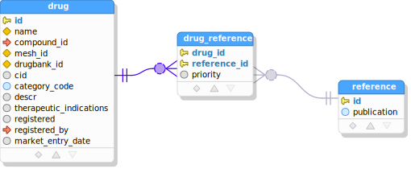

# SQL/JSON-Query

## Overview

This is a tool to be used as part of an application's build process to generate
SQL/JSON nested data queries and matching result type declarations.


As a developer, your job in the process is to supply a file `query-specs.ts`
which provides a list of query specifications, where each specification describes a
hierarchy of data to be fetched for a query. From these query specifications and a
database metadata file (generated from a database via included tool), SQL/JSON Query 
generates:
- SQL/JSON nested data queries for Oracle or Postgres to fetch the data
- Result type declarations in TypeScript or Java which match the structure of 
  the generated SQL and to which the query results can be directly deserialized
- Column-level metadata for all relations (tables/views) in TypeScript or Java, which
  can be used to refer to tables/columns in INSERT/UPDATE/DELETE statements in an
  error-resistant way


When generating queries, database metadata is used to verify all tables, fields, and
foreign key relationships used in the queries, failing with an error if any referenced
database items are not found in database metadata. A self-contained tool to fetch this
database metadata for Oracle and PostgresSQL databases is included.

The query generation work is all done at build time, and there is no run-time component
needed to use the generated SQL queries and generated result types. The SQL can be
executed by any preferred means, and deserialized to the generated result types using
any library suitable for the purpose, such as Jackson in Java, or via `JSON.parse()`
in TypeScript.

## Setup

The easiest way to enable query generation via SQL/JSON Query is to clone the 
`sqljson-query-dropin` project from
[the sqljson-query-dropin repo](https://github.com/scharris/sqljson-query-dropin),
which contains a nearly ready-to-go form of the tool.

- Clone the dropin repository

  ```git clone https://github.com/scharris/sqljson-query-dropin query-gen```

  Here we've installed the tool in a directory named `query-gen` for definiteness, but
  you can name and position the folder however you want.


- Next, install dependencies needed by the tool in the `query-gen folder`:

  ```cd query-gen; npm i```

  This step only needs to be performed once to install npm dependencies.


- Generate database metadata
  
  Add a script or manually-triggered step to your build process to perform the following whenever
  database metadata needs to be updated to reflect changes in the database:
  ```
  mvn -f query-gen/dbmd/pom.xml compile exec:java "-DjdbcProps=<props>" "-Ddb=<pg|ora>"
  ```
  
  Here `<props>` is the path to a properties file with JDBC connection information for
  the database to be examined. The expected format of the jdbc properties file is:
  ```
  jdbc.driverClassName=...
  jdbc.url=...
  jdbc.username=...
  jdbc.password=...
  ```
  
  The above command will produce output file `query-gen/dbmd/dbmd.json` containing the database
  metadata, which is where the tool expects to find the metadata while generating queries. On
  first run of metadata generation, examine this file to make sure that the expected tables have
  been found by the metadata generator.
  
  To remove unwanted tables from database metadata generation, add an additional property
  definition `-Ddbmd.table.pattern=<regex>` to the `mvn` command to only include relations
  whose name matches the given regular expression. The pattern defaults to `^[^$].*`.


- Define application queries in `query-gen/queries/query-specs.ts`

  Edit the `query-specs.ts` file in `query-gen/queries` to define application queries.
  The details of how to write query specifications are described below. Any tables, views
  and fields used in the queries must exist in the database metadata, so database metadata
  should be generated before proceeding to query generation.


- Generate SQL and result types:

  To generate SQL and matching Java result types:
  
  ```
  npm run --prefix query-gen generate-queries -- --sqlDir=../src/generated/sql --javaBaseDir=../src/generated/lib -javaQueriesPkg=gen.queries -javaRelMdsPkg=gen.relmds # --javaResultTypesHeader=...
  ```

  To generate SQL and matching TypeScript result types:
  
  ```
  npm run --prefix query-gen generate-queries -- --sqlDir=../src/generated/sql --tsQueriesDir=../src/generated/lib --tsRelMdsDir=../src/generated/lib --tsTypesHeader=queries/result-types-header-ts
  ```

  The java/tsTypesHeader parameters are not required, but can be used in case additional imports
  or comments are wanted at the top of the generated query result type files.


## Tutorial

TODO: Just link to a tutorial that defines a schema, shows fragments from ER diagram, and builds
various queries to include the tables shown in the ER diagram fragments.


## The Queries Specification - `QueryGroupSpec`

The structure that you supply to the query generator should conform to the `QueryGroupSpec`
interface, and it is usually defined in a file called `query-specs.ts`. This structure contains
speciciations for the queries to be generated and allows setting some options that apply to all
of the queries.

```typescript
interface QueryGroupSpec
{
  defaultSchema?: string;
  propertyNameDefault?: PropertyNameDefault;
  generateUnqualifiedNamesForSchemas: string[];
  querySpecs: QuerySpec[];
}
```
### QueryGroupSpec Properties

- `defaultSchema`

  Any unqualified table or view referenced in a query specification is assumed to
  belong to the default schema specified here. This allows table/view references to be
  unqualified in query definitions for convenience and readability, while also allowing
  the query generator to precisely find the relation in the database metadata, where
  relations are stored in fully qualified form.


- `propertyNameDefault`

  The property name default describes how json property names are to be
  derived from database field names, when the property name is not specified
  directly in the query specification.
  Valid values are:

  - `AS_IN_DB`: JSON property name will equal the database field name exactly.
A database field `account_number` would yield a JSON property name
      of `account_number` with this setting.

  - `CAMELCASE`: JSON property name will be the camelcase form of the database field
name. A database field `account_number` would yield a JSON property name
of `accountNumber` with this setting.
  

- `generateUnqualifiedNamesForSchemas`

  This setting determines which relation names are qualified in generated SQL. Any relation
  belonging to a schema in this list will be referred to in unqualified form in generated SQL.
  Your ability to use unqualified names in generated SQL depends on how your application connects
  to your database to execute the generated SQL. Generally if you connect to a schema directly
  (as with Oracle) or have it on a schema search path (if supported by your database such as
  with Postgres), then you should be able to add your schema in this list to generated unqualified
  names in your SQL. If you don't care how the generated SQL looks then it's always safe to leave
  this list empty.


- `querySpecs`

  These are the specifications for the SQL/JSON nested data queries to be generated for your
  application. Result types in either TypeScript or Java are also generated from these.
  The specifics of the query specifications are described in detail below.

### Usage example for `QueryGroupSpec`

If using the ready-made [project dropin](https://github.com/scharris/sqljson-query-dropin)
to add query generation capability to a project, then you define your single `QueryGroupSpec`
object in file `<query-gen-folder>/queries/query-specs.ts`, and export it from that module
as `queryGroupSpec`.

```typescript
// (file query-specs.ts)
export const queryGroupSpec: QueryGroupSpec = {
   defaultSchema: "foos",
   generateUnqualifiedNamesForSchemas: ["foos"],
   propertyNameDefault: "CAMELCASE",
   querySpecs: [
     // ...
   ]
};
```

## Query Specification

A query specification describes a single query as a hierarchy of data to be fetched. It usually
defines the generation of a single SQL file, but may specify multiple `resultRepresenations` in
which case multiple SQL files will be generated for the query. In all cases it yields at most
one TypeScript module and Java class representing result types for the query. A query specification
is described via the `QuerySpec` interface.

```typescript
interface QuerySpec
{
  queryName: string;
  tableJson: TableJsonSpec;
  resultRepresentations?: ResultRepr[];
  generateResultTypes?: boolean;
  generateSource?: boolean;
  propertyNameDefault?: PropertyNameDefault;
  orderBy?: string;
  forUpdate?: boolean;
  typesFileHeader?: string;
}
```

### QuerySpec Properties

- `queryName`

  This required field defines a name of the given query, which can be several words separated
  by spaces, dashes, or underscores, such as "drugs with cautions and functional categories query".
  The query name should be unique in the `QueryGroupSpec` and is used to form the names of the
  generated SQL files, as well as the module name or class name for generated TypeScript or Java
  sources representing the query result types. SQL file names and TypeScript module names are
  based on the dashed form of the tokenized query name, for example
  `drugs-with-cautions-and-functional-categories-query.sql/ts` for the query name above. The Java
  class name containing result type definitions is the camelcase form of the query name, for
  example `DrugsWithCautionsAndFunctionalCategoriesQuery`.


- `tableJson`

  This required field is the heart of the query definition, specifying a top table and nested
  related tables, recursively, with details about how to convert each to JSON format. This
  structure is described in detail below.


- `resultRepresentations`

  Contains from one to three SQL variants to be generated for the query. Each variant will be
  written to its own SQL file, with variant type appended to the query name if multiple variants
  are selected. The result representation variants differ in how the results are presented
  in database result sets. Any subset of the following variants may be chosen.

  * `JSON_OBJECT_ROWS`(**default**): The result set will consist of multiple rows, with one row
  per result row from the top table in the hierarchy of results. Each row consists of exactly
  one column, which contains the JSON object representation of the hierarchy of data for the
  top-level table row and its related data from related tables.

  * `JSON_ARRAY_ROW`: In this result style the query will yield only a single row, which consists
  of only one column. The entire result set in this case is represented as a single JSON array
  value, the elements of which are JSON objects representing the result rows from the top table
  and data related to the row from the related tables.

  * `MULTI_COLUMN_ROWS`: The result set will consist of multiple rows, with one row per
  result row from the top table in the hierarchy of results. Top level rows are presented in
  multi-column form as in the top level table itself. The column values themselves may be
  either database types coming directly from a table or JSON objects representing data
  collected from related tables.


- `generateResultTypes`

  Controls whether Java or TypeScript source code representing result types for the query should be generated.
  The default value is `true`.


- `generateSource`

  If `false`, no SQL nor Java or TypeScript source will be generated.
  The default value is `true`.


- `propertyNameDefault`

  Controls how JSON property names are derived from database field names for
  this specific query, overriding any setting at the level of the `QueryGroupSpec`.
  See the description of the field of the same name in `QueryGroupSpec` for details.
  Defaults to `CAMELCASE` if defined in neither the `QuerySpec` nor the `QueryGroupSpec`.


- `orderBy`

  This property is a SQL expression controlling the ordering of the results from the top-level
  table in the query.


- `forUpdate`

  If `true`, a `for update` clause will be added to the generated SQL, causing the fetched
  rows to be locked for the duration of the transaction in which the query occurs.


- `typesFileHeader`

  Optional text which will be included above the generated Java or TypeScript result type definitions.
  This text is not interpreted by the tool and will be included verbatim in the generated source code,
  just below standard imports if any. Often this is used to add imports for types referred to in
  customized field result types.


## Table JSON Specification

The `TableJsonSpec` structure describes how selected parts of or expressions involving the data content
of a given table and related tables should be represented in JSON format. TableJsonSpec is the heart
of the query specification, where it describes how to form JSON output for the top table which is the
subject of the query. The structure also describes how data for related tables is to be included via
nested `TableJsonSpec` in the `parentTables` and `childTables` members of the `TableJsonSpec`, and so
on recursively to any level of nesting required through related tables.

```typescript
interface TableJsonSpec
{
  table: string;
  fieldExpressions?: (string | TableFieldExpr)[];
  parentTables?: ParentSpec[]; // (ParentSpec extends TableJsonSpec)
  childTables?: ChildSpec[];   // (ChildSpec extends TableJsonSpec)
  recordCondition?: RecordCondition;
}
```

### TableJsonSpec Properties

- `table`

  The name of the top-level table for which this structure describes JSON output. Data from
  other, related tables may be described via the members `parentTables` and `childTables` as
  described below. The table name may appear unqualified if a `defaultSchema` has been specified
  for the enclosing `QueryGroupSpec`. The table name may be entered with quotes in which case it
  will be used in quoted form exactly as entered in query generation, or without quotes in which
  case the database's default name case folding will be applied automatically (to uppercase for
  Oracle and lowercase for Postgres). 


- `fieldExpressions`

  Lists the properties that come from fields of the top-level table named in `table`, or from expressions
  formed from those fields. Each entry can either be a simple `string`, in which case it should equal a
  column name of the top level table, or else a structure of type `TableFieldExpr` which allows additional
  options to be specified for the output property.

  ```typescript
  interface TableFieldExpr
  {
    field?: string;
    expression?: string;
    jsonProperty?: string; // Required if value is not a simple field name.
    fieldTypeInGeneratedSource?: string | {[srcLang: string]: string};
    withTableAliasAs?: string; // Table alias escape sequence which may be used in value (default '$$').
  }
  ```

  - A simple `string` value is interpreted as a `TableFieldExpr` with the `field` property of that value and
  no other properties provided.
   
  - Exactly one of `field` and `expression` should be specified. In the `field` case the value comes directly
  from a database column, while an `expression` may be any SQL expression involving the database fields in scope.
  The expression should be entered just as it should appear in generated SQL, with the exception that `$$`
  will be replaced with an alias to the table named in `table`. Usually qualification with `$$` is not
  necessary.

  - If `expression` is specified, then `fieldTypeInGeneratedSource` is required to assign a type
  to the expression in generated source code. If only one target language (Java or TypeScript) is in use,
  then the result type can be entered as a simple `string`. If multiple target languages are in use then
  the result type can be supplied as an object mapping the target language to the result type declaration
  for the expression in that language. For example: `{'TS': 'string', 'Java': 'String'}`.

  - If `jsonProperty` is provided, it determines the name of the property in the JSON object representing
  the table row. If not specified, then the output property name is determined by the `propertyNameDefault`
  value of the enclosing `QuerySpec` or `QueryGroupSpec` as described above, defaulting to `CAMELCASE`
  if neither is found.

  - Field Expressions Example
    ```typescript
      fieldExpressions: [
         'account_num',  // (1) equiv to { field: 'account_num', jsonProperty: 'accountNum' } for default CAMELCASE property naming
         {field: 'id', jsonProperty: 'accountId'}, // (2) specify custom property name
         {expression: 'select name from state where code = $$.state_code', fieldTypeInGeneratedSource: 'String'} // (3)
      ]
    ```
    The above example shows the three forms used to express field expressions: (1) table-field short form,
    (2) table-field full form, (3) general expression.

- `parentTables`

  The `parentTables` member of `TableJsonSpec` scribes the contributions from parent tables of the table
  named in `table` to the JSON output. Each element of the array is a `TableJsonSpec`, and may also include
  additional options particular to the parent/child relationship. A parent specification can describe
  an *inline* parent table, whose fields are merged into the child table's, or else a *referenced* parent
  table whose row value is included as a JSON object via a property in the child. Additional members are
  provided for controlling how the parent table is joined with the child table.
  See the [Parent Table Specification](#parent-spec) section below for details.


- `childTables`

  Each item of the `childTables` member of `TableJsonSpec` describes a property to be added to the
  parent JSON to hold a collection of records from a single child table. Each element of the array is
  a `TableJsonSpec`, with additional options particular to the child/parent relationship.
  See the [Child Table Specification](#child-spec) section below for details on specifying child
  collections, and [Representing Many to Many Relationships](#many-many) for usage of child
  specifications in many-many relationships.


- `recordCondition`

  The `recordCondition` member contains an arbitrary SQL predicate, suitable for inclusion
  in a SQL `WHERE` clause, to filter records in the subject table of the `TableJsonSpec` as
  named in `table`. The record condition should conform to the `RecordCondition` interface.

  ```typescript
  interface RecordCondition
  {
    sql: string;
    paramNames?: string[];
    withTableAliasAs?: string;
  }
  ```
  
  - The `sql` property holds the SQL predicate expression, just as it would appear in a SQL `WHERE` clause.
    Within the expression, usages of `$$` will be expanded to be the alias of the subject table in the
    generated query, unless the alias placeholder has been customized via the `withTableAlias` property in
    which case that character sequence will be expanded to the table alias instead. The SQL expression may
    contain parameters such as `:myParam` or `?`, in which case it is the responsibility of the program
    executing the SQL to set the parameters properly where the SQL is finally executed. Complex expressions
    involving boolean conjunctions and parentheses to nest conditions are allowed here.

  - The `paramNames` member, if provided, informs the query generator of any parameters that are used in
    the `sql` member, in which case it will helpfully add members or defined constants to the Java or
    TypeScript source code containing the parameter names. This is a convenience for the users of the SQL
    to assist with auto-completion and to prevent usage of wrong or missing parameter names, and is in no
    case required to properly execute the SQL.
  
  - The `withTableAlias` member controls the text that will be expanded to the subject table alias in
    the SQL expression in the `sql` property. Defaults to `$$`. Usually unqualified field names are
    unambiguous so no table alias is necessary.


## <a id="parent-spec"></a>Parent Table Specification

Parent table specifications appear in the `parentTables` member of a `TableJsonSpec`, where they
describe the contributions from parent tables of the table named in `table` to the JSON output.
The contribution from a single parent table is described by interface `ParentSpec` which derives from
`TableJsonSpec`. The subtype adds a few optional members to describe the join, which are only
occasionally necessary, and also adds a member controlling whether the fields from the parent
should be included *inline* with the child table's own field expressions, or else wrapped via a
single object reference property.


  ```typescript
  interface ParentSpec extends TableJsonSpec
  {
    referenceName?: string | undefined;
    alias?: string | undefined;
    customJoinCondition?: CustomJoinCondition;
    viaForeignKeyFields?: string[];
  }
  ```

- If `referenceName` is provided for a parent table, then the value for a row of the parent will
be wrapped as a JSON object which is referenced via a property of this name in the child's JSON
object value. If a `referenceName` is not provided, then the contents from the parent table's JSON
output will be included directly, *inlined*, into in the referencing table's JSON output. In
the inlined fields case, ie. when `referenceName` is not provided, the parent's own fields,
child collections, and fields from its own parents will all appear directly among the referencing
table's own fields, child collections, and content from other parent tables.


- The `alias` property allows assigning a custom alias for the parent table. This is not often
necessary, but it may be used in expressions provided in property `recordCondition` which is
described further below as a way of filtering records via custom conditions.


- At most one of `customJoinCondition` and `viaForeignKeyFields` can be specified, in both cases to
control how the join to the parent is accomplished from the table named in `table`. Normally neither
of these properties is needed, for the common case that there is one and only one foreign key between
the table named in `table` and the parent table as found in the database metadata. If neither property
is provided and no suitable foreign key is found, or more than one such foreign key is found, then
query generation will fail with an error.


- The `viaForeignKeyFields` option allows disambiguating when multiple foreign keys exist
between the child table (named in `table`) and the parent table, by listing the names of
the foreign key fields to be matched. The order doesn't matter for the foreign key fields
here, but they must exist as foreign key fields in the database metadata or else query
generation will fail with an error.


- The `customJoinCondition` allows matching via fields that do not have a foreign key constraint
defined in the database (metadata). The structure is a list of field pairs between the child and
parent tables that should be equated to form the join condition:

  ```typescript
  interface CustomJoinCondition
  {
    equatedFields: FieldPair[];
  }

  interface FieldPair
  {
    childField: string;
    parentPrimaryKeyField: string;
  }
  ```
  For example:
  ```typescript
      parentTables: [
        {
          table: 'foo',
          // ...
          customJoinCondition: {equatedFields: [{childField: 'fooId', parentPrimaryKeyField: 'id'}]}
        }
      ]
  ```

## <a id="child-spec"></a>Child Table Specification

Child table specifications appear in the `childTables` member of a `TableJsonSpec`. They describe
the collection properties which are contributed to the JSON output from child tables of the parent
table named in `table`. The contribution from a single child table is described by interface
`ChildSpec` which derives from `TableJsonSpec`. The subtype adds a collection name property and
additional optional properties to describe the join between parent and child, which are only
occasionally necessary. It also adds members controlling filtering and ordering, and whether
child tables exporting only a single property should have those property values "unwrapped"
in the collection instead of being wrapped in JSON objects.


```typescript
interface ChildSpec extends TableJsonSpec
{
  collectionName: string;
  foreignKeyFields?: string[];
  customJoinCondition?: CustomJoinCondition;
  unwrap?: boolean;
  filter?: string;
  orderBy?: string;
}
```

- The `collectionName` member is required, it determines the name of the collection property
holding the child record content within the parent JSON output.


- The `foreignKeyFields` property determines the foreign key fields in the child table which
should be used to join to the parent. A foreign key constraint on this set of fields targeting
the proper parent table must be present in the database metadata or an error is reported. If
only one foreign key constraint exists between the child and parent, it is not necessary to
specify this property; it is intended to disambiguate when multiple foreign keys between the
child and parent are defined.


- The `customJoinCondition` allows matching via fields that do not have a foreign key constraint
defined in the database (metadata). The structure is a list of field pairs between the child and
parent tables that should be equated to form the join condition:

  ```typescript
  interface CustomJoinCondition
  {
    equatedFields: FieldPair[];
  }

  interface FieldPair
  {
    childField: string;
    parentPrimaryKeyField: string;
  }
  ```
  For example:
  ```typescript
  const barsQuery: QuerySpec = {
    queryName: 'bars query',
    tableJson: {
      table: 'bar',
      // ...
      childTables: [
        {
          collectionName: "foos",
          table: 'foo',
          // ...
          // (This custom join condition is not necessary if a proper foreign key constraint is defined on barId.)
          customJoinCondition: {equatedFields: [{childField: 'barId', parentPrimaryKeyField: 'id'}]}
        }
      ]
    }
  }
  ```

- The `unwrap` property only applies for the case that the `ChildSpec` only exposes a single property,
whether from fields of the child table itself or from child or parent tables. In that case you may choose
to *unwrap* the property values by specifying `unwrap: true` to prevent the values from being wrapped in a JSON
object (which would normally represent the child record itself) within the collection property.


- The `filter` property, if specified, should be a boolean expression suitable for inclusion
in a SQL `WHERE` condition. If provided then only child records for which the expression
evaluates to true will be included in the collection.


- The `orderBy` property, if specified, should  be a SQL expression by which the child records
will be sorted before they are projected into the JSON collection. This expression can be
anything that is suitable for a SQL order by clause.


## <a id="many-many"></a>Representing Many to Many Relationships

So far it's been described how to bring in information from parent tables reached via a
many-to-one or -zero/one relationship, and from child tables via a one-to-many relationship.
But we haven't yet described how to include data from a many-to-many relationship.

In fact we don't need any new constructs to handle the many-to-many case. We start by including
the intermediate/intersection table as a child table collection within our initial table which 
represents one side of the relationship. Then within that child table specification we include
whatever parts we want from the intersection table's other parent as an "inlined" parent
specification, by not specifying `referenceName` in the `ParentSpec`.

### Many-Many Relationship Example

As an example let's say that we have a table `drug` which has a many-many relationship to
a table `reference` representing published literature references about the drug. An
intermediate table `drug_reference` establishes the many-to-many relationship. Within the
JSON output for our drug table, we'd like to include a collection of literature references,
and to also have their priorities from the intermediate table.




We accomplish this with the following specification:
```typescript
const drugsQuery: QuerySpec = {
  queryName: 'drugs query',
  tableJson: {
    table: "drug",
    fieldExpressions: ["id", "name"], 
    childTables: [
      {
        collectionName: "prioritizedReferences",
        table: "drug_reference",        // The intermediate/intersection table.
        fieldExpressions: ["priority"], // Include any properties wanted from intermediate table here.
        parentTables: [
          {
            // No "referenceName" property is given, so contents are "inlined" into the intermediate table output.
            table: "reference",         // The "other" entity in the many-many relationship
            fieldExpressions: ["publication"]
          }
        ],
        orderBy: "priority asc" // Sort the intermediate table records by priority, ascending.
      }
     ]
  }
}
```

In summary, we included the intermediate/intersection table `drug_reference` as we would do
with any child table. And then we included the `reference` table as a parent within the
intermediate table but without specifying a `referenceName` property, so its contents are
inlined with those properties (if any) from the intermediate table itself. Here we included
the `priority` column from the intermediate table, but often we may not incude any properties
from the intermediate table itself.
