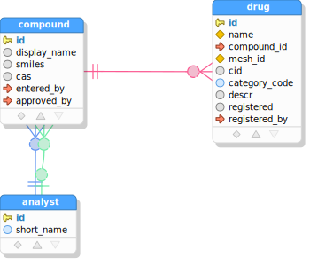

# SQL/JSON-Query TUTORIAL

## Prerequisites
- [NodeJS 14+](https://nodejs.org/en/)
- [Java JDK 11+](https://jdk.java.net) &dagger;
- [Apache Maven 3.6+](https://maven.apache.org/download.cgi) &dagger;

Make sure that Maven's `mvn` is on your path and `JAVA_HOME` is defined to point to your JDK11+
installation directory. From the node installation, `npm` needs to be on your path as well.

&dagger; NOTE: The Java and Maven dependencies can be dispensed with, if you arrange other means of executing
the [database metadata query](https://github.com/scharris/sqljson-query-dropin/tree/main/dbmd/src/main/resources)
for your database type and the saving of its results to `query-gen/dbmd/dbmd.json`. The query has one parameter
`relPat` which is a regular expression for table names to be included (you can pass '.*' or adjust to suit).
The Maven project simply executes this query with a default for `relPat` and saves the results to file.

## Project Directory Setup

Let's create a directory for our query generation experiments.
```console
mkdir sjq-example
cd sjq-example
```

Now we will install the query-generator by cloning the "sqljson-query-dropin" repository, and
initialize it via `npm`:

```console
git clone https://github.com/scharris/sqljson-query-dropin.git query-gen

(cd query-gen && npm i)
```

Here we've installed the query generator in subdirectory `query-gen`, but it can be put anywhere,
so long as commands below are adjusted accordingly.

## Database Setup

Follow the directions in [database setup](tutorial-database-setup.md), to setup a local Postgres database for
use in this tutorial.

## Generate Database Metadata

Now that the database is created and SQL/JSON-Query installed, we can generate our database metadata
via the following Maven command:

```console
mvn -f query-gen/dbmd/pom.xml compile exec:java -DjdbcProps=jdbc.props -Ddb=pg
```

As noted above, it's also easy to generate the database metadata without relying on Maven or Java, if you
will just execute the
[database metadata query](https://github.com/scharris/sqljson-query-dropin/tree/main/dbmd/src/main/resources)
for your database type (Oracle or Postgres) and save the resulting json value to file
`query-gen/dbmd/dbmd.json`. The query has one parameter `relPat` which is a regular expression for table
names to be included, for which you can pass '.*' or adjust it as required.

The metadata is generated at `query-gen/dbmd/dbmd.json`, which is where it's expected to be for the
query generator. It's good to glance at its contents when you're getting started just to make sure
that the tool found the tables and views you expected it to.

## Query Generation

We're now ready to write our query specifications and to generate the SQL and result types sources from them.

## Single-Table Query
We're expected to define our queries in file `query-gen/queries/query-specs.ts`. Create the file in a text editor
with the following initial contents:

```typescript
import {QueryGroupSpec, QuerySpec, RecordCondition} from 'sqljson-query';

const drugsQuery1: QuerySpec = {
  queryName: 'drugs query 1',
  tableJson: {
     table: 'drug',
     recordCondition: { sql: 'category_code = :catCode', paramNames: ['catCode'] },
     fieldExpressions: [
        { field: 'name', jsonProperty: 'drugName' },
        'category_code', // short for: { field: 'category_code', jsonProperty: 'categoryCode' }
        { expression: '$$.cid + 1000',
          jsonProperty: 'cidPlus1000',
          fieldTypeInGeneratedSource: {TS: 'number | null', Java: '@Nullable Long'} },
     ],
  }
};

export const queryGroupSpec: QueryGroupSpec = {
   defaultSchema: 'public',
   generateUnqualifiedNamesForSchemas: [ 'public' ],
   propertyNameDefault: 'CAMELCASE',
   querySpecs: [
      drugsQuery1,
   ]
};
``` 

Here the first definition, `drugsQuery1` is our first query and is of type `QuerySpec`. The lower definition
represents the total set of queries and is the only export for the module. It contains the list of queries to
generate in `querySpecs`, which is just `drugsQuery1` at present. It also specifies some options that apply to
all queries such as the default schema name to be assumed for unqualified tables.


In `drugsQuery1` we've defined a simple query based on just a single table, `drug`. It's given a name via
`queryName` which is used to determine the names of the generated SQL files and TypeScript/Java source files.
The rest of the query specification lies in the `tableJson` property, which describes how to form JSON output
for a given "top" table and whatever related tables it may want to include in its output.

Let's briefly go over the properties of the `tableJson` object, since it's the centerpiece of our query.

```typescript
tableJson: {
  table: 'drug',
  recordCondition: { sql: 'category_code = :catCode', paramNames: ['catCode'] },
  fieldExpressions: [
    { field: 'name', jsonProperty: 'drugName' },
    'category_code', // short for: { field: 'category_code', jsonProperty: 'categoryCode' }
    { expression: '$$.cid + 1000',
      jsonProperty: 'cidPlus1000',
      fieldTypeInGeneratedSource: {TS: 'number | null', Java: '@Nullable Long'} },
  ],
}
```

- The `table` property specifies the top (and here the only) table in this JSON output, which is table `drug`.


- The `recordCondition` is present to filter the rows of our "drug" table, which can be an arbitrary SQL predicate,
basically anything suitable for a WHERE clause. Here we're restricting results by `category_code` value, and using
a SQL parameter named `catCode` as part of the predicate expression. You can use whatever notation is needed
by your SQL execution runtime to indicate parameters.  The `paramNames` property is not required, but if it is
provided then a constant will be defined in the TypeScript or Java source code for each parameter entered here
with value equal to the parameter name, to help catch errors involving using wrong parameter names.


- Finally, the `fieldExpressions` property lists the fields and expressions involving the fields from `table` which
to be included as properties in the JSON objects representing the table rows. The field expressions take three
forms here, which cover all possibilities:

  - The first item shows the general form for a simple table field:
    ```{ field: 'name', jsonProperty: 'drugName' }```. In this case the source database table field and desired
    JSON property name are both given explicitly.
  - The second form ('category_code') is simply a string which is the database field name, in which case the JSON
  property name is automatically set to the camelcase form of the given name ('categoryCode'), because of our choice
  of "propertyNameDefault: 'CAMELCASE'" in the query group specification. Another option is 'AS_IN_DB', leaving
  property names defaulting to the database field name without modification.
  - The third and final entry is a general expression involving database fields:
    ```
    { expression: '$$.cid + 1000',
      jsonProperty: 'cidPlus1000',
      fieldTypeInGeneratedSource: {TS: 'number | null', Java: '@Nullable Long'} }
    ```
  In this case `expression` is provided instead of `field` (these two are mutually exclusive), and the `jsonProperty`
  and `fieldTypeInGeneratedSource` properties are *required* for expressions, to tell the tool how to name the
  expression and what type its values should be given in result types. Notice that the result types are given by
  source language. With this form you should be able to include any kind of expression that could be included in a
  SQL `SELECT` clause. The syntax `$$` shown in the example expression can be used to qualify the table's fields,
  though it is usually not necessary. Any occurrences of `$$` will be replaced with the alias generated for the
  current table by the query generator.

The `tableJson` object must conform to the `TableJsonSpec` interface, which is described in more detail in the
[TableJsonSpec](query-specifications.md#table-json-specification) documentation. This structure is one of the most
important structures to understand, because it is also the base interface for describing contributions from related
parent and child tables to the JSON output.

So that describes our first query on the `drug` table. Before we generate the SQL and TypeScript sources for it,
let's make source directories to hold our generated sources:
```console
mkdir -p src/sql src/ts
```

Now we can generate the SQL and TypeScript sources as follows:

```console
npm run --prefix query-gen generate-queries -- --sqlDir=../src/sql --tsQueriesDir=../src/ts --tsRelMdsDir=../src/ts
```

If you open the generated SQL file at `src/sql/drugs-query-1.sql`, you should see something like:
```sql
select
  -- row object for table 'drug'
  jsonb_build_object(
    'drugName', q."drugName",
    'categoryCode', q."categoryCode",
    'cidPlus1000', q."cidPlus1000"
  ) json
from (
  -- base query for table 'drug'
  select
    d.name "drugName",
    d.category_code "categoryCode",
    d.cid + 1000 "cidPlus1000"
  from
    drug d
  where (
    (category_code = :catCode)
  )
) q
```  

If we try executing the query in psql, supplying the value 'A' for parameter `catCode`, we should 
see output like the following:
```json lines
{"drugName": "Test Drug 2", "cidPlus1000": 1198, "categoryCode": "A"}
{"drugName": "Test Drug 4", "cidPlus1000": 1396, "categoryCode": "A"}
```

Also a TypeScript module was generated, at `src/ts/drugs-query-1.ts` with contents similar to:
```typescript
// The types defined in this file correspond to results of the following generated SQL queries.
export const sqlResource = "drugs-query-1.sql";

// query parameters
export const catCodeParam = 'catCode';

// Below are types representing the result data for the generated query, with top-level type first.
export interface Drug
{
  drugName: string;
  categoryCode: string;
  cidPlus1000: number | null;
}
```
This TypeScript module defines an interface `Drug` which matches the form of the result objects in the
query results. It also defines a constant for the parameter name as a convenience/safety feature, and
lets you know the corresponding SQL file that was generated as well.

## Adding a Parent Table


The single-table query above lacks information about the compound found in each drug (we're assuming
a drug can only have one such compound in  this example schema). So let's make a new query adding this
information from the `compound` table. The `compound` table is a parent table of our top table `drug`.

We add references to parent tables via the optional property `parentTables` within our `tableJson` object.
Each entry in `parentTables` is itself a structure like that in `tableJson` &mdash; in other words it is a
[TableJsonSpec](query-specifications.md#table-json-specification). It also supports a few additional
properties to control the join mechanism between parent and child. See the
[Parent Table Specification](query-specifications.md#parent-table-specification) documentation for full details.

Now let's proceed to make a copy of our previous query and assign it to `drugsQuery2`, with a new parent tables
section added as follows:

```typescript
const drugsQuery2: QuerySpec = {
   queryName: 'drugs query 2',
   tableJson: {
      table: 'drug',
      recordCondition: { sql: 'category_code = :catCode', paramNames: ['catCode'] },
      fieldExpressions: [
         { field: 'name', jsonProperty: 'drugName' },
         'category_code',
      ],
      // (Added) -->
      parentTables: [
         {
            referenceName: 'primaryCompound',
            table: 'compound',
            fieldExpressions: [
               { field: 'id', jsonProperty: 'compoundId' },
               { field: 'display_name', jsonProperty: 'compoundDisplayName' },
            ],
         }
      ],
     // <-- (Added)
   }
};
```

Here we've added `parentTables` array property with a single entry representing the `compound` table.
The majority of the contents of this parent entry should be familiar, with `table` specifying the parent
table name, and `fieldExpressions` controlling which fields to include in its JSON output.

The only new property here is `referenceName`, which gives a name for the property within the child `drug`
JSON object that references the parent `compound` JSON object. The `referenceName` property is *optional*:
if it is omitted, then the fields from `compound` would be included as properties *inlined* among the
fields/expressions coming directly from the child table `drug` - i.e. without a wrapping object property.
Examples of inlined parent table fields are included in some of the examples below. 

Don't forget to add `drugsQuery2` to the query group representing the queries to be generated:

```typescript
export const queryGroupSpec: QueryGroupSpec = {
   // ...
   querySpecs: [
      drugsQuery1,
      drugsQuery2, // <-- (added)
   ]
};
```

Now let's again generate the SQL and TypeScript sources with the same command as before:

```console
npm run --prefix query-gen generate-queries -- --sqlDir=../src/sql --tsQueriesDir=../src/ts --tsRelMdsDir=../src/ts
```

You can examine the generated SQL for our new query at `src/sql/drugs-query-2.sql`. Basically it has added a new
subquery projecting a `json_build_object()` expression from within the `SELECT` clause of what was our original
drugs query. You will also find the additional `Compound` results structure defined in the corresponding result
types definition module at `src/ts/drugs-query-2.ts`:

```typescript
export interface Compound
{
  compoundId: number;
  compoundDisplayName: string | null;
}
```

If we run the query (with 'A' for parameter `catCode`), we'll see results like:
```json lines
{"drugName": "Test Drug 2", "categoryCode": "A", "primaryCompound": {"compoundId": 2, "compoundDisplayName": "Test Compound 2"}}
{"drugName": "Test Drug 4", "categoryCode": "A", "primaryCompound": {"compoundId": 4, "compoundDisplayName": "Test Compound 4"}}
```
We see our compound information has been added in property `primaryCompound` as expected.

## Adding Parent Tables via Explicit Foreign Keys



We've got basic information from the `compound` table in our results now, but `compound` itself references interesting
information in its *own* parent table, `analyst`, which we'd also like to include in our results. As mentioned earlier,
a parent (or child) entry such as our `parentCompound` entry in `parentTables` can have its own parent or child table
entries, so we can just nest a `parentTables` property there to pull in information from `analyst`.

The only wrinkle in this plan is that there are *two* ways that table `compound` references table `analyst`, via two
different foreign keys: one for the data-entering analyst, and another for the approving analyst. So we just have to
be specific about the foreign key to use when pulling in analyst information. We'll assume that we want information
for both analysts wherever available (though including just one or the other would be fine as well but would need the
same disambiguation to be provided).

Add a new query by copying the previous one and adding a *nested* `parentTables` property within the `primaryCompound`
entry:

```typescript
const drugsQuery3: QuerySpec = {
   queryName: 'drugs query 3',
   tableJson: {
      table: 'drug',
      recordCondition: { sql: 'category_code = :catCode', paramNames: ['catCode'] },
      fieldExpressions: [
         { field: 'name', jsonProperty: 'drugName' },
         'category_code',
      ],
      parentTables: [
         {
            referenceName: 'primaryCompound',
            table: 'compound',
            fieldExpressions: [
               { field: 'id', jsonProperty: 'compoundId' },
               { field: 'display_name', jsonProperty: 'compoundDisplayName' },
            ],
            // (Added) -->
            parentTables: [
               {
                  table: 'analyst',
                  fieldExpressions: [
                     { field: 'short_name', jsonProperty: 'enteredByAnalyst' }
                  ],
                  viaForeignKeyFields: ['entered_by'] // <- select one of two foreign keys to analyst
               },
               {
                  table: 'analyst',
                  fieldExpressions: [
                     { field: 'short_name', jsonProperty: 'approvedByAnalyst' }
                  ],
                  viaForeignKeyFields: ['approved_by'] // <- select one of two foreign keys to analyst
               }
            ]
            // <-- (Added)
         }
      ],
   }
};
```

Now we've added two potentially different analyst names within the `primaryCompound` objects, while guiding the query
generator to use the appropriate foreign key for each by specifying the foreign key fields in `viaForeignKeyFields`
for each parent instance. Specifying the foreign key fields like this is always necessary whenever more than one
foreign key constraint exists between the two tables in the direction in context.

### Inlined Parent Fields

Also note that we did not specify a `referenceName` for either of the `analyst` parent table entries, which means
that the field expressions (just the analyst name in this case) will be included inline among the fields from
`compound`. When just pulling a field or two from a parent, it's often more convenient to dispense with a wrapping
object around the field(s) to avoid unnecessary nesting.


Add the new query to the exported `queryGroupSpec` as always, and regenerate the query SQL and sources as before:

```console
npm run --prefix query-gen generate-queries -- --sqlDir=../src/sql --tsQueriesDir=../src/ts --tsRelMdsDir=../src/ts
```

Our SQL has gotten more complex as expected, and in the result type declaration module we see that our two analyst
fields have been added to the `Compound` result interface:

```typescript
export interface Compound
{
  compoundId: number;
  compoundDisplayName: string | null;
  enteredByAnalyst: string;
  approvedByAnalyst: string | null;
}
```

Note that nullability has been correctly inferred for the fields, based both on the field nullability in the parent
table (`short_name` being non-nullable in this case), but also on the nullability of the referencing foreign key
(only non-nullable for the entering analyst).

Running our generated query in `src/sql/drugs-query-3.sql` with 'A' for `catCode`, we see the following output which
contains our two analysts with each compound:

```json lines
{"drugName": "Test Drug 2", ..., "primaryCompound": {"compoundId": 2, "enteredByAnalyst": "jdoe", "approvedByAnalyst": "sch", ...}
{"drugName": "Test Drug 4", ..., "primaryCompound": {"compoundId": 4, "enteredByAnalyst": "jdoe", "approvedByAnalyst": "sch", ...}}
```

That covers the main points for obtaining data from parent tables. For more information see the
[Parent Table Specification](query-specifications.md#parent-table-specification) documentation.

## Adding a Child Collection


Next we'll add a collection of related advisories for the drugs. The `advisory` table is a child table of table
`drug` as seen in the diagram. We want a collection property which collects for each drug the list of related
advisories. Child table collection properties are described in the optional property `childTables` within the
`tableJson`. Each entry in `childTables` can specify any of the properties allowed in `tableJson` as described above,
to control the translation of the child table's content to JSON (in other words it is a
[TableJsonSpec](query-specifications.md#table-json-specification)). It also allows a few additional properties: a
`collectionName` property to name the collection member, and a few optional properties related to customizing or
disambiguating the join between parent and child, which are needed only infrequently.
See the [Child Table Specification](query-specifications.md#child-table-specification) documentation for full details.

To add the advisories data, add a new query based on the previous one which adds a new `childTables` section within
`tableJson` as follows:

```typescript
const drugsQuery4: QuerySpec = {
   queryName: 'drugs query 4',
   tableJson: {
      table: 'drug',
      recordCondition: { sql: 'category_code = :catCode', paramNames: ['catCode'] },
      fieldExpressions: [
         { field: 'name', jsonProperty: 'drugName' },
         'category_code',
      ],
      parentTables: [
         {
            referenceName: 'primaryCompound',
            table: 'compound',
            fieldExpressions: [
               { field: 'id', jsonProperty: 'compoundId' },
               { field: 'display_name', jsonProperty: 'compoundDisplayName' },
            ],
            parentTables: [
               {
                  table: 'analyst',
                  fieldExpressions: [
                     { field: 'short_name', jsonProperty: 'enteredByAnalyst' }
                  ],
                  viaForeignKeyFields: ['entered_by']
               },
               {
                  table: 'analyst',
                  fieldExpressions: [
                     { field: 'short_name', jsonProperty: 'approvedByAnalyst' }
                  ],
                  viaForeignKeyFields: ['approved_by']
               }
            ]
         }
      ],
      // (Added) -->
      childTables: [
         {
            collectionName: 'advisories',
            table: 'advisory',
            fieldExpressions: [
               'advisory_type_id',
               { field: 'text', jsonProperty: 'advisoryText' },
            ]
         }
      ],
      // <-- (Added)
   }
};
```

TODO


TODO: Add information to each advisory via advisory's parent and grandparent.

```typescript
const drugsQuery5: QuerySpec = {
   queryName: 'drugs query 5',
   tableJson: {
      table: 'drug',
      recordCondition: { sql: 'category_code = :catCode', paramNames: ['catCode'] },
      fieldExpressions: [
         { field: 'name', jsonProperty: 'drugName' },
         'category_code',
      ],
      parentTables: [
         {
            referenceName: 'primaryCompound',
            table: 'compound',
            fieldExpressions: [
               { field: 'id', jsonProperty: 'compoundId' },
               { field: 'display_name', jsonProperty: 'compoundDisplayName' },
            ],
            parentTables: [
               {
                  table: 'analyst',
                  fieldExpressions: [
                     { field: 'short_name', jsonProperty: 'enteredByAnalyst' }
                  ],
                  viaForeignKeyFields: ['entered_by']
               },
               {
                  table: 'analyst',
                  fieldExpressions: [
                     { field: 'short_name', jsonProperty: 'approvedByAnalyst' }
                  ],
                  viaForeignKeyFields: ['approved_by']
               }
            ]
         }
      ],
      childTables: [
         {
            collectionName: 'advisories',
            table: 'advisory',
            fieldExpressions: [
               'advisory_type_id',
               { field: 'text', jsonProperty: 'advisoryText' },
            ],
            // (Added) -->
            parentTables: [
               {
                  table: 'advisory_type',
                  fieldExpressions: [ { field: 'name', jsonProperty: 'advisoryTypeName' } ],
                  parentTables: [
                     {
                        table: 'authority',
                        fieldExpressions: [ { field: 'name', jsonProperty: 'advisoryTypeAuthorityName' } ]
                     }
                  ]
               }
            ]
            // <-- (Added)
         }
      ]
   }
};
```

TODO: Add references from far side of a many-many relationship.

```typescript
const drugsQuery6: QuerySpec = {
   queryName: 'drugs query 6',
   tableJson: {
      table: 'drug',
      recordCondition: { sql: 'category_code = :catCode', paramNames: ['catCode'] },
      fieldExpressions: [
         { field: 'name', jsonProperty: 'drugName' },
         'category_code',
      ],
      parentTables: [
         {
            referenceName: 'primaryCompound',
            table: 'compound',
            fieldExpressions: [
               { field: 'id', jsonProperty: 'compoundId' },
               { field: 'display_name', jsonProperty: 'compoundDisplayName' },
            ],
            parentTables: [
               {
                  table: 'analyst',
                  fieldExpressions: [
                     { field: 'short_name', jsonProperty: 'enteredByAnalyst' }
                  ],
                  viaForeignKeyFields: ['entered_by'] // <- select on of two foreign keys to analyst
               },
               {
                  table: 'analyst',
                  fieldExpressions: [
                     { field: 'short_name', jsonProperty: 'approvedByAnalyst' }
                  ],
                  viaForeignKeyFields: ['approved_by'] // <- select one of two foreign keys to analyst
               }
            ]
         }
      ],
      childTables: [
         {
            collectionName: 'advisories',
            table: 'advisory',
            fieldExpressions: [
               'advisory_type_id',
               { field: 'text', jsonProperty: 'advisoryText' },
            ],
            parentTables: [
               {
                  table: 'advisory_type',
                  fieldExpressions: [ { field: 'name', jsonProperty: 'advisoryTypeName' } ],
                  parentTables: [
                     {
                        table: 'authority',
                        fieldExpressions: [ { field: 'name', jsonProperty: 'advisoryTypeAuthorityName' } ]
                     }
                  ]
               }
            ]
         },
         // (Added) -->
         {
            collectionName: 'prioritizedReferences',
            table: 'drug_reference',
            fieldExpressions: [ 'priority' ],
            parentTables: [
               {
                  table: "reference",
                  fieldExpressions: [ 'publication' ]
               }
            ],
            orderBy: 'priority asc'
         }
         // <-- (Added)
      ]
   }
};
```
