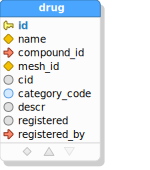
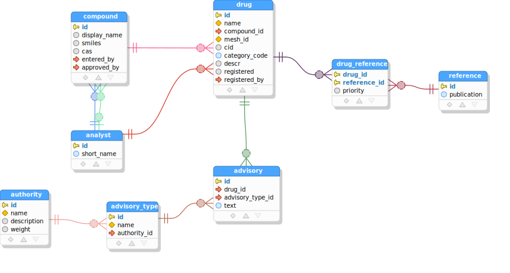

# SQL/JSON-Query TUTORIAL

## Setup

### Prerequisites

- [NodeJS 16+](https://nodejs.org/en/)
- [Git](https://git-scm.com/)

### Project Directory Setup

Install the query generator by cloning the "sqljson-query-dropin" repository:

```sh
git clone https://github.com/scharris/sqljson-query-dropin.git query-gen
```

This folder defines a small NodeJS project to facilitate query generation. It defines commands for
generating query-related source files and for fetching the database metadata needed by the query
generator. From here on, we'll execute our commands from within the `query-gen` directory unless
otherwise noted.

```sh
cd query-gen
```

Next initialize the dependencies and compile the query generation script:

```sh
npm i && npx tsc
```

### Database Setup

Follow the directions in [database setup](tutorial-database-setup.md), to setup a local Postgres or
MySQL database for use in this tutorial. After you've completed the database setup, the database
should be listening for connections with the connection information properties as provided in file
`db/conn.props`.

### Generate Database Metadata

Now that the database is created and SQL/JSON-Query is installed, we can generate our database metadata
via the following command:

For Postgres:

```sh
npx gen-dbmd --connProps db/conn.props --db pg --outputDir .
```

For MySQL, substitute `--db mysql` instead.

An npm script that does the same thing is configured in `package.json`, which we can run with
the simpler command:

```sh
npm run gen-dbmd
```

For either variant of the command, two metadata files should have been generated in the same directory,
`dbmd.json` and `relations-metadata.ts`.

## Query Generation

Now with the database metadata generated, we're ready to write our query specifications and
to generate the SQL and result types sources. We'll start with a simple query of a single table.

### Single-Table Query

We'll define our queries in file `gen-queries.ts`. Our folder contains a self-contained TypeScript
project, so you should be able to get proper TypeScript language support from your editor or IDE as
you edit or view this file. Edit the file `gen-queries.ts` now to contain the following contents
(which may be present already as an example):

```typescript
// query-gen/gen-queries.ts
import { QueryGroupSpec, QuerySpec, RecordCondition, generateQueriesWithArgvOptions } from 'sqljson-query';

const drugsQuery1: QuerySpec = {
  queryName: 'drugs query 1',
  tableJson: {
    table: 'drug',
    recordCondition: { sql: 'category_code = :catCode', paramNames: ['catCode'] },
    fieldExpressions: [
      { field: 'name', jsonProperty: 'drugName' },
      'category_code', // short for: { field: 'category_code', jsonProperty: 'categoryCode' }
      { expression: '$$.cid + 1000',
        jsonProperty: 'cidPlus1000',
        fieldTypeInGeneratedSource: {TS: 'number | null', Java: '@Nullable Long'} },
    ],
  }
};

export const queryGroupSpec: QueryGroupSpec = {
  defaultSchema: 'drugs',
  generateUnqualifiedNamesForSchemas: [ 'drugs' ],
  propertyNameDefault: 'CAMELCASE',
  querySpecs: [
    drugsQuery1,
  ]
};

// Run the query generator with options specified in arguments to this script.

generateQueriesWithArgvOptions(queryGroupSpec, process.argv)
  .then(() => { console.log("Query generation completed."); })
  .catch((e) => {
    console.error(e);
    console.error("Query generation failed due to error - see error detail above.");
    process.exit(1);
  });
```

Here the first definition, `drugsQuery1` is our first query and is of type `QuerySpec`. The lower
definition, `queryGroupSpec`, represents the total set of queries to be generated, and sets a few
options applying to all queries that it contains, such as the default schema name to be assumed
for unqualified table names. We'll ignore the function call at the bottom, which actually runs
the query generation process with our query definitions when the script is executed.




In `drugsQuery1` we've defined a simple query based on a single table, `drug`. The query is given a
name via `queryName` which is used to determine the names of the generated SQL files and TypeScript/Java
source files. The rest of the query specification lies in the `tableJson` property, which describes how
to form JSON output for a given "top" table, and whatever related tables it may want to pull data from,
into its own output.

Let's briefly go over the properties of the `tableJson` object, since it's the centerpiece of our query.

```typescript
tableJson: {
  table: 'drug',
  recordCondition: { sql: 'category_code = :catCode', paramNames: ['catCode'] },
  fieldExpressions: [
    { field: 'name', jsonProperty: 'drugName' },
    'category_code', // short for: { field: 'category_code', jsonProperty: 'categoryCode' }
    { expression: '$$.cid + 1000',
      jsonProperty: 'cidPlus1000',
      fieldTypeInGeneratedSource: {TS: 'number | null', Java: '@Nullable Long'} },
  ],
}
```

- The `table` property specifies the top (and here the only) table in this JSON output, which is table
`drug`.

- The `recordCondition` is present to filter the rows of our `drug` table, which can be an arbitrary SQL
predicate &mdash; basically anything suitable for a SQL `WHERE` clause. Here we're restricting results by
`category_code` value, and using a SQL parameter named `catCode` as part of the predicate expression. For
the parameters you can use whatever notation is needed by your SQL execution runtime to indicate them within
the expression. The `paramNames` property is not required, but if it is provided then a constant will be
defined in the TypeScript or Java source code for each parameter entered here with value equal to the
parameter name, to help catch errors involving the use of wrong parameter names. Using literal field names
like `category_code` here may lead to runtime errors in case of typos or database changes. See
[Validating Database Object Names in Free-Form Expressions](#validating-database-object-names-in-free-form-expressions)
below for a safer alternative.

- Finally, the `fieldExpressions` property lists the fields, and expressions involving the fields,
from `table` which are to be included as properties in the JSON objects representing the table rows.
The field expressions take three forms here, which cover all possibilities:

  - The first item shows the general form for a simple table field:

    ```typescript
    { field: 'name', jsonProperty: 'drugName' }
    ```

    In this case the source database table field and desired JSON property name are both given explicitly.

  - The second form, `'category_code'`, is simply a string which is the database field name, in which
    case the JSON property name is automatically set to the camelcase form of the given name
    (`'categoryCode'`), because of our choice of `"propertyNameDefault: 'CAMELCASE'"` in the query
    group specification. Another option would have been 'AS_IN_DB' which would make property names
    default to the verbatim database field names. Thus the `'category_code'` entry is equivalent to:

    ```typescript
    { field: 'category_code', jsonProperty: 'categoryCode' }
    ```

  - The third and final entry represents a general SQL expression involving the table's fields:

    ```typescript
    { expression: '$$.cid + 1000',
      jsonProperty: 'cidPlus1000',
      fieldTypeInGeneratedSource: {TS: 'number | null', Java: '@Nullable Long'} }
    ```

  In this case `expression` is provided instead of `field` (these two are mutually exclusive), and both
  the `jsonProperty` and `fieldTypeInGeneratedSource` properties are *required* for expressions, to tell
  the tool how to name the expression and what type its values should be given in result types, by target
  language. With this form of field expression you should be able to represent any sort of expression that
  is suitable to include as a column value in a SQL `SELECT` clause. The syntax `$$` shown in the example
  expression can be used to qualify the table's fields, though it is usually not necessary. Any occurrences
  of `$$` will be replaced with the alias generated for the current table by the query generator.

The `tableJson` object must conform to the `TableJsonSpec` interface, which is described in more detail
in the [TableJsonSpec](query-specifications.md#table-json-specification) documentation. This structure
is one of the most important structures to understand, because it is also the base interface for
describing contributions from related parent and child tables to the JSON output.

So that describes our first query on the `drug` table. Now we can generate the SQL and TypeScript
sources from our query specification as follows:

```sh
tsc && node gen-queries.js --dbmd dbmd.json --sqlDir sql --tsDir ts
```

A shorter form of the above is provided by a preconfigured npm script in `package.json`, which can be
executed via

```sh
npm run gen-queries
```

, and we'll use this shorter version from here on.

You should now have two new directories, `sql` holding generated SQL queries, and `ts` holding
the corresponding result types that were generated for the queries at the same time.

If you open the generated SQL file at `sql/drugs-query-1.sql`, you should see something like:

```sql
select
  jsonb_build_object(
    'drugName', d.name,
    'categoryCode', d.category_code,
    'cidPlus1000', d.cid + 1000
  ) json
from
  drug d
where (
  (category_code = :catCode)
)
```

The SQL shown here is for a Postgres example database, for a MySQL database it will differ slightly. The
generated SQL is database-specific generally, with the database type having been determined automatically
from the database metadata that was generated above at `dbmd.json`.

Now open your preferred SQL execution tool for your database, and try executing the above SQL with 'A' for
the `catCode` parameter (in psql, you can use `\set catCode '''A'''` before executing the sql).
You should see output like the following:

```sh
(row 1) {"drugName": "Test Drug 2", "cidPlus1000": 1198, "categoryCode": "A"}
(row 2) {"drugName": "Test Drug 4", "cidPlus1000": 1396, "categoryCode": "A"}
```

(If the use of a parameter in the query makes for a nuisance in your SQL execution tool, feel free
 to replace it with literal 'A' in this and following queries - the flow of the tutorial will not be
 affected).

Also take a look at the TypeScript module that was generated at `ts/drugs-query-1.ts` with contents
similar to:

```typescript
// The types defined in this file correspond to results of the following generated SQL queries.
export const sqlResource = "drugs-query-1.sql";

// query parameters
export const catCodeParam = 'catCode';

// Below are types representing the result data for the generated query, with top-level type first.
export interface Drug
{
  drugName: string;
  categoryCode: string;
  cidPlus1000: number | null;
}
```

This TypeScript module defines an interface `Drug` which matches the form of the the result object in
each row of the query results. It also defines a constant for the parameter name as a convenience and
safety feature, and lets you know the corresponding SQL file that was generated from the same query
specification as well.

### Adding Parent Tables


The single-table query above lacks information about the compound found in each drug (we're assuming
a drug can only have one such compound in  this example schema). So let's make a new query adding this
information from the `compound` table. The `compound` table is a parent table of our top table `drug`.

Similarly, we'll also add information about the registering analyst for each drug, from the `analyst`
parent table of drug.

We add references to parent tables via the optional property `parentTables` within our `tableJson` object.
Each entry in `parentTables` is itself a structure like that in `tableJson` &mdash; in other words it is a
[TableJsonSpec](query-specifications.md#table-json-specification). It also supports a few additional
properties to control the join mechanism between parent and child (which usually don't need to be specified).
See the [Parent Table Specification](query-specifications.md#parent-table-specification) documentation for
full details.

Now let's proceed to make a variant of our previous query assigned to `drugsQuery2`, having a new parent
tables section as follows:

```typescript
const drugsQuery2: QuerySpec = {
   queryName: 'drugs query 2',
   tableJson: {
      table: 'drug',
      recordCondition: { sql: 'category_code = :catCode', paramNames: ['catCode'] },
      fieldExpressions: [
         { field: 'name', jsonProperty: 'drugName' },
         'category_code',
      ],
      // (Added) -->
      parentTables: [
         {
            referenceName: 'primaryCompound',
            table: 'compound',
            fieldExpressions: [
               { field: 'id', jsonProperty: 'compoundId' },
               { field: 'display_name', jsonProperty: 'compoundDisplayName' },
            ],
         },
         {
            // No "referenceName" property specified here => "inline" the properties from this parent.
            table: 'analyst',
            fieldExpressions: [
               { field: 'short_name', jsonProperty: 'registeredByAnalyst' },
            ],
         }
      ],
     // <-- (Added)
   }
};
```

Here we've added the `parentTables` array property with entries for the `compound` and `analyst` tables.
The contents of the parent entries should be familiar because they're mostly the same as would appear
in the top-level `tableJson`. We have a `table` property specifying the parent table name, and
`fieldExpressions` controlling which fields to include in its JSON output.

The only new property here is `referenceName`, which gives a name for the property within the child `drug`
object that references the parent `compound` object. The `referenceName` property is *optional*. If it
were omitted for `compound`, then the fields from `compound` would be included as properties *inlined*
among the fields/expressions coming directly from the child table `drug` - i.e. without a wrapping object
property. In fact this is the case for the registering analyst information here: because the analyst entry
does not specify a `referenceName`, its fields are inlined among those of the drug table itself.

Don't forget to add `drugsQuery2` to the query group representing the queries to be generated:

```typescript
export const queryGroupSpec: QueryGroupSpec = {
   // ...
   querySpecs: [
      drugsQuery1,
      drugsQuery2, // <-- (added)
   ]
};
```

Now let's again generate the SQL and TypeScript sources with the same command as before:

```sh
npm run gen-queries
```

You can examine the generated SQL for our new query at `sql/drugs-query-2.sql`. Basically it has added
a new subquery projecting a `json_build_object()` expression from within the `SELECT` clause of what was
our original drugs query, as well as a new FROM clause subquery for the inlined analyst field. You will also
find the additional `Compound` results structure defined in the corresponding result types definition module at
`ts/drugs-query-2.ts`:

```typescript
export interface Compound
{
  compoundId: number;
  compoundDisplayName: string | null;
}
```

If we run the query (with 'A' for parameter `catCode`), we'll see result row values like the following:

```json
{
  "drugName": "Test Drug 2",
  "categoryCode": "A",
  "primaryCompound": {
    "compoundId": 2,
    "compoundDisplayName": "Test Compound 2"
  },
  "registeredByAnalyst": "sch"
}
```

We see our compound information has been added in property `primaryCompound` as expected, and the
registering analyst is represented in the string valued property `registeredByAnalyst`.  Notice that
the registering analyst information does not have a wrapping object (it is "inlined"), because
`referenceName` was omitted in its parent table entry.

### Adding Parent Tables with Explicit Foreign Keys


We've got basic information from the `compound` table in our results now, but `compound` itself
references interesting information in its *own* parent table, `analyst`, which we'd also like to
include in our results. As mentioned earlier, a parent (or child) entry such as our `parentCompound`
entry in `parentTables` can have its own parent or child table entries, so we can just nest a
`parentTables` property there to pull in information from `analyst`.

The only wrinkle in this plan is that there are *two* ways that table `compound` references table
`analyst`, via two different foreign keys: one for the data-entering analyst, and another for the
approving analyst. So we just have to be specific about the foreign key to use when pulling in
analyst information. We'll assume that we want information for both analysts wherever available
(though including just one or the other would be fine as well, but would need the same
disambiguation to be provided).

Add a new query based on the previous one, adding a nested `parentTables` property within the
`primaryCompound` entry:

```typescript
const drugsQuery3: QuerySpec = {
   queryName: 'drugs query 3',
   tableJson: {
      table: 'drug',
      recordCondition: { sql: 'category_code = :catCode', paramNames: ['catCode'] },
      fieldExpressions: [
         { field: 'name', jsonProperty: 'drugName' },
         'category_code',
      ],
      parentTables: [
         {
            referenceName: 'primaryCompound',
            table: 'compound',
            fieldExpressions: [
               { field: 'id', jsonProperty: 'compoundId' },
               { field: 'display_name', jsonProperty: 'compoundDisplayName' },
            ],
            // (Added) -->
            parentTables: [
               {
                  table: 'analyst',
                  fieldExpressions: [
                     { field: 'short_name', jsonProperty: 'enteredByAnalyst' }
                  ],
                  viaForeignKeyFields: ['entered_by'] // <- select one of two foreign keys to analyst
               },
               {
                  table: 'analyst',
                  fieldExpressions: [
                     { field: 'short_name', jsonProperty: 'approvedByAnalyst' }
                  ],
                  viaForeignKeyFields: ['approved_by'] // <- select one of two foreign keys to analyst
               }
            ]
            // <-- (Added)
         },
         {
            table: 'analyst',
            fieldExpressions: [
               { field: 'short_name', jsonProperty: 'registeredByAnalyst' },
            ],
         }
      ],
   }
};
```

Now we've added two analyst name properties within the `primaryCompound` entries, while guiding the query
generator to use the appropriate foreign key for each by specifying the foreign key fields in
`viaForeignKeyFields` in each instance. Specifying the foreign key fields like this is always necessary
whenever more than one foreign key constraint exists between the two tables in the direction in context.

Also note that we did not specify a `referenceName` for either of the `analyst` parent table entries,
which means that the field expressions `enteredByAnalyst` and `approvedByAnalyst` will be included
inline among the fields from `compound` itself.

Add the new query to the exported `queryGroupSpec` as always, and regenerate the query SQL and sources
as before:

```sh
npm run gen-queries
```

In the result type declaration module `ts/drugs-query-3.ts`, we see that our two analyst fields have
been added to the `Compound` result interface:

```typescript
export interface Compound
{
  compoundId: number;
  compoundDisplayName: string | null;
  enteredByAnalyst: string;
  approvedByAnalyst: string | null;
}
```

Note that nullability has been correctly inferred for the fields, based both on the field nullability
in the parent table (`short_name` being non-nullable in this case), but also on the nullability of the
referencing foreign key (only non-nullable for the entering analyst).

Our SQL at `sql/drugs-query-3.sql` has gotten more complex as expected. Running this query with 'A'
for `catCode`, we see output like the following in each result row, which contains our two analysts
with each compound:

```json
{
  "drugName": "Test Drug 2",
  "categoryCode": "A",
  "primaryCompound": {
    "compoundId": 2,
    "enteredByAnalyst": "jdoe",
    "approvedByAnalyst": "sch",
    "compoundDisplayName": "Test Compound 2"
  },
  "registeredByAnalyst": "sch"
}
```

That covers the main points for obtaining data from parent tables. For more information see the
[Parent Table Specification](query-specifications.md#parent-table-specification) documentation.

### Adding a Child Collection


Next we'll add a collection of related advisories for the drugs. The `advisory` table is a child table
of table `drug` as seen in the diagram. Child table collection properties are described in a `tableJson`
(any `TableJsonSpec` instance in fact) via the optional property `childTables`. Each entry in
`childTables` can specify any of the properties allowed in `tableJson` as described above, to control
the translation of the child table's content to JSON &mdash; in other words a `childTables` entry is a
[TableJsonSpec](query-specifications.md#table-json-specification). It also allows a few additional
properties: a `collectionName` property to name the collection member, and a few optional properties
related to customizing or disambiguating the join between parent and child, which are needed only
infrequently. See the
[Child Table Specification](query-specifications.md#child-table-specification) documentation for full
details.

To add the drug advisories data, add a new query based on the previous one which adds a new
`childTables` section within `tableJson` as follows:

<hr>
<hr>
<hr>

```typescript
const drugsQuery4: QuerySpec = {
   queryName: 'drugs query 4',
   tableJson: {
      table: 'drug',
      recordCondition: { sql: 'category_code = :catCode', paramNames: ['catCode'] },
      fieldExpressions: [
         { field: 'name', jsonProperty: 'drugName' },
         'category_code',
      ],
      parentTables: [
         {
            referenceName: 'primaryCompound',
            table: 'compound',
            fieldExpressions: [
               { field: 'id', jsonProperty: 'compoundId' },
               { field: 'display_name', jsonProperty: 'compoundDisplayName' },
            ],
            parentTables: [
               {
                  table: 'analyst',
                  fieldExpressions: [
                     { field: 'short_name', jsonProperty: 'enteredByAnalyst' }
                  ],
                  viaForeignKeyFields: ['entered_by']
               },
               {
                  table: 'analyst',
                  fieldExpressions: [
                     { field: 'short_name', jsonProperty: 'approvedByAnalyst' }
                  ],
                  viaForeignKeyFields: ['approved_by']
               }
            ]
         },
         {
            table: 'analyst',
            fieldExpressions: [
               { field: 'short_name', jsonProperty: 'registeredByAnalyst' },
            ],
         }
      ],
      // (Added) -->
      childTables: [
         {
            collectionName: 'advisories',
            table: 'advisory',
            fieldExpressions: [
               'advisory_type_id',
               { field: 'text', jsonProperty: 'advisoryText' },
            ]
         }
      ],
      // <-- (Added)
   }
};
```

Add `drugsQuery4` to `queryGroupSpec` and run the sources generator with our usual command:

```sh
npm run gen-queries
```

If you examine the generated result types module for the query at `ts/drugs-query-4.ts`, you should
see a new `advisories` property of type `Advisory[]` within the `Drug` type, as well as a definition
for the `Advisory` type itself.

Try running the SQL at `sql/drugs-query-4.sql` with 'A' for `catCode`, and verify that the query
produces an array of drug advisories. The json value in each row should look like:

```json
{
  "drugName": "Test Drug 2",
  "advisories": [
    {
      "advisoryText": "Advisory concerning drug 2",
      "advisoryTypeId": 1
    },
    {
      "advisoryText": "Caution concerning drug 2",
      "advisoryTypeId": 2
    },
    {
      "advisoryText": "Heard this might be bad -anon2",
      "advisoryTypeId": 3
    }
  ],
  "categoryCode": "A",
  "primaryCompound": {
    "compoundId": 2,
    "enteredByAnalyst": "jdoe",
    "approvedByAnalyst": "sch",
    "compoundDisplayName": "Test Compound 2"
  },
  "registeredByAnalyst": "sch"
}
```

### Pulling Fields through Multiple Parents


With our advisories added above, it would be helpful if we included details from `advisory_type` with
each advisory, and better still if we also had data from `advisory_type`'s own parent table `authority`.
Since the entries of `childTables` and `parentTables` conform to
the [TableJsonSpec](query-specifications.md#table-json-specification) interface, they support arbitrary
nesting of parent and child tables, and we can achieve our desired result by nesting.

Our strategy is first to add `advisory_type` as a parent table within the `advisory` entry. Then we will
add `authority` as a parent table within the `advisory_type` entry.

We will also include each added parent as "inlined", by not giving a reference property name, so the
parent's fields will be inlined among the fields of its child table without wrapping the parent data
in an unnecessary object wrapper.

Make a variant of the previous query assigned to `drugsQuery5`, adding information from `advisory_type`
and `authority` within each `advisory` as follows:

```typescript
const drugsQuery5: QuerySpec = {
   queryName: 'drugs query 5',
   tableJson: {
      table: 'drug',
      recordCondition: { sql: 'category_code = :catCode', paramNames: ['catCode'] },
      fieldExpressions: [
         { field: 'name', jsonProperty: 'drugName' },
         'category_code',
      ],
      parentTables: [
         {
            referenceName: 'primaryCompound',
            table: 'compound',
            fieldExpressions: [
               { field: 'id', jsonProperty: 'compoundId' },
               { field: 'display_name', jsonProperty: 'compoundDisplayName' },
            ],
            parentTables: [
               {
                  table: 'analyst',
                  fieldExpressions: [
                     { field: 'short_name', jsonProperty: 'enteredByAnalyst' }
                  ],
                  viaForeignKeyFields: ['entered_by']
               },
               {
                  table: 'analyst',
                  fieldExpressions: [
                     { field: 'short_name', jsonProperty: 'approvedByAnalyst' }
                  ],
                  viaForeignKeyFields: ['approved_by']
               }
            ]
         },
         {
            table: 'analyst',
            fieldExpressions: [
               { field: 'short_name', jsonProperty: 'registeredByAnalyst' },
            ],
         }
      ],
      childTables: [
         {
            collectionName: 'advisories',
            table: 'advisory',
            fieldExpressions: [
               'advisory_type_id',
               { field: 'text', jsonProperty: 'advisoryText' },
            ],
            // (Added) -->
            parentTables: [
               {
                  table: 'advisory_type',
                  fieldExpressions: [ { field: 'name', jsonProperty: 'advisoryTypeName' } ],
                  parentTables: [
                     {
                        table: 'authority',
                        fieldExpressions: [ { field: 'name', jsonProperty: 'advisoryTypeAuthorityName' } ]
                     }
                  ]
               }
            ]
            // <-- (Added)
         }
      ]
   }
};
```

Add the new `drugsQuery5` query to the exported `queryGroupSpec`, and regenerate the query SQL and
sources again:

```sh
npm run gen-queries
```

In the generated result types module for the query at `ts/drugs-query-5.ts`, we should see new fields for
the advisory type name and authority name. These were pulled from the advisory table's parent, and from
the parent of its parent, respectively. By using this technique we can pull fields through any number of
parent associations.

```typescript
export interface Advisory
{
  advisoryTypeId: number;
  advisoryText: string;
  advisoryTypeName: string;
  advisoryTypeAuthorityName: string;
}
```

Running the SQL at `sql/drugs-query-5.sql`, we should see advisory the additional information in each
advisory entry.

### Including Data from Many-Many Relationships

We've discussed above the handling of relationships with parent tables (many to one), and with child
tables (one to many), but nothing yet about how to include data through many-to-many relationships.


It turns out we don't need any new constructs to handle this case. We can include data from the far side
of a many-many relationship by first including the intersection table as a direct child table of our
starting table, and then including the far side table as an inlined parent within that intersection table
entry.

As an example let's add data from the `reference` table (representing bibliographic references) to our
drugs data. We will include within each drug a collection of the drug's references, also including the
priority of each reference particular to the drug from the intermediate table. We'll also sort the
references collections by priority.

Define a new query `drugsQuery6`, as follows:

```typescript
const drugsQuery6: QuerySpec = {
   queryName: 'drugs query 6',
   tableJson: {
      table: 'drug',
      recordCondition: { sql: 'category_code = :catCode', paramNames: ['catCode'] },
      fieldExpressions: [
         { field: 'name', jsonProperty: 'drugName' },
         'category_code',
      ],
      parentTables: [
         {
            referenceName: 'primaryCompound',
            table: 'compound',
            fieldExpressions: [
               { field: 'id', jsonProperty: 'compoundId' },
               { field: 'display_name', jsonProperty: 'compoundDisplayName' },
            ],
            parentTables: [
               {
                  table: 'analyst',
                  fieldExpressions: [
                     { field: 'short_name', jsonProperty: 'enteredByAnalyst' }
                  ],
                  viaForeignKeyFields: ['entered_by'] // <- select on of two foreign keys to analyst
               },
               {
                  table: 'analyst',
                  fieldExpressions: [
                     { field: 'short_name', jsonProperty: 'approvedByAnalyst' }
                  ],
                  viaForeignKeyFields: ['approved_by'] // <- select one of two foreign keys to analyst
               }
            ]
         },
         {
            table: 'analyst',
            fieldExpressions: [
               { field: 'short_name', jsonProperty: 'registeredByAnalyst' },
            ],
         }
      ],
      childTables: [
         {
            collectionName: 'advisories',
            table: 'advisory',
            fieldExpressions: [
               'advisory_type_id',
               { field: 'text', jsonProperty: 'advisoryText' },
            ],
            parentTables: [
               {
                  table: 'advisory_type',
                  fieldExpressions: [ { field: 'name', jsonProperty: 'advisoryTypeName' } ],
                  parentTables: [
                     {
                        table: 'authority',
                        fieldExpressions: [ { field: 'name', jsonProperty: 'advisoryTypeAuthorityName' } ]
                     }
                  ]
               }
            ]
         },
         // (Added) -->
         {
            collectionName: 'prioritizedReferences',
            table: 'drug_reference',
            fieldExpressions: [ 'priority' ],
            parentTables: [
               {
                  table: "reference",
                  fieldExpressions: [ 'publication' ]
               }
            ],
            // orderBy: 'priority asc' // Omit orderBy if using MySQL database - OK for pg,hsql,ora.
         }
         // <-- (Added)
      ]
   }
};
```

NOTE: If you aren't using  a MySQL example database, you can uncomment the `orderBy` property at bottom
of the query definition to enable ordering within the child collection. Ordering in child collections is
currently not supported for the MySQL database target.

We already had a `childTables` property in our `drug` specification from previous queries (for
advisories), so we've just added another entry for our intersection table `drug_reference` in the same
array. We project the `priority` column of the intersection table into the results via its
`fieldExpressions`, though it is not required to project anything from the intersection table in general.
Then within that same `drug_reference` entry, we add `reference` as a parent table, without specifying
a `referenceName` property. That way its projected fields (just `publication` here) are included inline
within the `drug_reference` object data, ie. as a sibling to any properties that might be included from
the intersection table.

Note that we're pulling data from independent child tables in a single query, which is a source of
difficulty for purely join-based approaches (those that don't employ aggregation functions), which
would generally have to perform multiple queries to get the same data.

Add the `drugsQuery6` query to the exported `queryGroupSpec`, and regenerate the query SQL and sources
as before:

```sh
npm run gen-queries
```

### Validating Database Object Names in Free-Form Expressions

As mentioned previously, field and table references in queries are verified against database metadata
when queries are generated. However, there are exceptions where custom expressions are used in a
query specification, such as in a `recordCondition` property or in an `expression` property of a
field expression. In our previous queries, we just used literals to refer to field names in these
cases. That method works, but this has the disadvantage that such references are not checked for
validity at query generation time, and may cause runtime errors in case of typos or database
changes.

There is however an easy way to reference table and field names from database metadata for use in the
"free form" parts of any query specification. As an example, let's make the `recordCondition` in our
previous query reference the `category_code` field in the database metadata, for safety.

First we need to add an import near the top of our `gen-queries.ts` file:
```typescript
import {Schema_drugs as drugs, verifiedFieldNames} from './relations-metadata';
```

This imports metadata about tables and fields in a form where table and field names are literal
object keys, to make them amenable to the TypeScript compiler's type analysis. It also includes a
function to conveniently verify field names against this metadata. Let's use it in a new variant
of our previous query, which will be our final query.

### Final Query

```typescript
const {category_code} = verifiedFieldNames(drugs.drug); // category_code === 'category_code'

const drugsQuery7: QuerySpec = {
   queryName: 'drugs query 7',
   tableJson: {
      table: 'drug',
      // (Modified) -->
      recordCondition: { sql: `${category_code} = :catCode`, paramNames: ['catCode'] },
      // <-- (Modified)
      fieldExpressions: [
         { field: 'name', jsonProperty: 'drugName' },
         'category_code',
      ],
      parentTables: [
         {
            referenceName: 'primaryCompound',
            table: 'compound',
            fieldExpressions: [
               { field: 'id', jsonProperty: 'compoundId' },
               { field: 'display_name', jsonProperty: 'compoundDisplayName' },
            ],
            parentTables: [
               {
                  table: 'analyst',
                  fieldExpressions: [
                     { field: 'short_name', jsonProperty: 'enteredByAnalyst' }
                  ],
                  viaForeignKeyFields: ['entered_by'] // <- select on of two foreign keys to analyst
               },
               {
                  table: 'analyst',
                  fieldExpressions: [
                     { field: 'short_name', jsonProperty: 'approvedByAnalyst' }
                  ],
                  viaForeignKeyFields: ['approved_by'] // <- select one of two foreign keys to analyst
               }
            ]
         },
         {
            table: 'analyst',
            fieldExpressions: [
               { field: 'short_name', jsonProperty: 'registeredByAnalyst' },
            ],
         }
      ],
      childTables: [
         {
            collectionName: 'advisories',
            table: 'advisory',
            fieldExpressions: [
               'advisory_type_id',
               { field: 'text', jsonProperty: 'advisoryText' },
            ],
            parentTables: [
               {
                  table: 'advisory_type',
                  fieldExpressions: [ { field: 'name', jsonProperty: 'advisoryTypeName' } ],
                  parentTables: [
                     {
                        table: 'authority',
                        fieldExpressions: [ { field: 'name', jsonProperty: 'advisoryTypeAuthorityName' } ]
                     }
                  ]
               }
            ]
         },
         {
            collectionName: 'prioritizedReferences',
            table: 'drug_reference',
            fieldExpressions: [ 'priority' ],
            parentTables: [
               {
                  table: "reference",
                  fieldExpressions: [ 'publication' ]
               }
            ],
            // orderBy: 'priority asc' // Omit orderBy if using MySQL database - OK for pg,hsql,ora.
         }
      ]
   }
};
```

Now the existence of the `category_code` field in the record condition is checked at time of query
generation. If the field ceases to exist with that name in the `drug` table, and database metadata
is regenerated to reflect the database change, then the query build process would fail, as we would
want it to, due to the invalid field reference. A similar function, `verifiedTableName` can be
imported as well to check a table name against database metadata in a similar way.

That completes our final query specification. Add it to the query group spec and generate sources:

```sh
npm run gen-queries
```

### Final Query Review

Let's review what's been accomplished with the [final query specification](#final-query) above.

The query includes data from each of the following related tables using all the foreign keys shown:



From the query specification above, a SQL query is generated at `sql/drugs-query-7.sql`, which includes
data from all of the above tables:

```sql
-- [ THIS QUERY WAS AUTO-GENERATED, ANY CHANGES MADE HERE MAY BE LOST. ]
-- JSON_OBJECT_ROWS results representation for drugs query 7
select
  jsonb_build_object(
    'drugName', d.name,
    'categoryCode', d.category_code,
    'registeredByAnalyst', a."registeredByAnalyst",
    'primaryCompound', (
      select
        jsonb_build_object(
          'compoundId', c.id,
          'compoundDisplayName', c.display_name,
          'enteredByAnalyst', a."enteredByAnalyst",
          'approvedByAnalyst', a1."approvedByAnalyst"
        ) json
      from
        compound c
        -- parent table 'analyst', joined for inlined fields
        left join (
          select
            a.id as "_id",
            a.short_name "enteredByAnalyst"
          from
            analyst a
        ) a on c.entered_by = a."_id"
        -- parent table 'analyst', joined for inlined fields
        left join (
          select
            a.id as "_id",
            a.short_name "approvedByAnalyst"
          from
            analyst a
        ) a1 on c.approved_by = a1."_id"
      where (
        d.compound_id = c.id
      )
    ),
    'advisories', (
      select
        coalesce(jsonb_agg(jsonb_build_object(
          'advisoryTypeId', a.advisory_type_id,
          'advisoryText', a.text,
          'advisoryTypeName', at_."advisoryTypeName",
          'advisoryTypeAuthorityName', at_."advisoryTypeAuthorityName"
        )),'[]'::jsonb) json
      from
        advisory a
        -- parent table 'advisory_type', joined for inlined fields
        left join (
          select
            at_.id as "_id",
            at_.name "advisoryTypeName",
            -- field(s) inlined from parent table 'authority'
            a."advisoryTypeAuthorityName"
          from
            advisory_type at_
            -- parent table 'authority', joined for inlined fields
            left join (
              select
                a.id as "_id",
                a.name "advisoryTypeAuthorityName"
              from
                authority a
            ) a on at_.authority_id = a."_id"
        ) at_ on a.advisory_type_id = at_."_id"
      where (
        a.drug_id = d.id
      )
    ),
    'prioritizedReferences', (
      select
        coalesce(jsonb_agg(jsonb_build_object(
          'priority', dr.priority,
          'publication', r.publication
        ) order by priority asc),'[]'::jsonb) json
      from
        drug_reference dr
        -- parent table 'reference', joined for inlined fields
        left join (
          select
            r.id as "_id",
            r.publication as publication
          from
            reference r
        ) r on dr.reference_id = r."_id"
      where (
        dr.drug_id = d.id
      )
    )
  ) json
from
  drug d
  -- parent table 'analyst', joined for inlined fields
  left join (
    select
      a.id as "_id",
      a.short_name "registeredByAnalyst"
    from
      analyst a
  ) a on d.registered_by = a."_id"
where (
  (category_code = :catCode)
)
```

Also generated is a TypeScript result types module `ts/drugs-query-7.ts`, to represent the types in
the query result set:

```typescript
// The types defined in this file correspond to results of the following generated SQL queries.
export const sqlResource = "drugs-query-7.sql";


// query parameters
export const catCodeParam = 'catCode';

// Below are types representing the result data for the generated query, with top-level type first.
export interface Drug
{
  drugName: string;
  categoryCode: string;
  registeredByAnalyst: string;
  primaryCompound: Compound;
  advisories: Advisory[];
  prioritizedReferences: DrugReference[];
}

export interface Compound
{
  compoundId: number;
  compoundDisplayName: string | null;
  enteredByAnalyst: string;
  approvedByAnalyst: string | null;
}

export interface Advisory
{
  advisoryTypeId: number;
  advisoryText: string;
  advisoryTypeName: string;
  advisoryTypeAuthorityName: string;
}

export interface DrugReference
{
  priority: number | null;
  publication: string;
}
```

When run, the SQL query results in values like the following from one of the result rows:

```json
{
  "drugName": "Test Drug 2",
  "advisories": [
    {
      "advisoryText": "Advisory concerning drug 2",
      "advisoryTypeId": 1,
      "advisoryTypeName": "Boxed Warning",
      "advisoryTypeAuthorityName": "FDA"
    },
    {
      "advisoryText": "Caution concerning drug 2",
      "advisoryTypeId": 2,
      "advisoryTypeName": "Caution",
      "advisoryTypeAuthorityName": "FDA"
    },
    {
      "advisoryText": "Heard this might be bad -anon2",
      "advisoryTypeId": 3,
      "advisoryTypeName": "Rumor",
      "advisoryTypeAuthorityName": "Anonymous"
    }
  ],
  "categoryCode": "A",
  "primaryCompound": {
    "compoundId": 2,
    "enteredByAnalyst": "jdoe",
    "approvedByAnalyst": "sch",
    "compoundDisplayName": "Test Compound 2"
  },
  "registeredByAnalyst": "sch",
  "prioritizedReferences": [
    {
      "priority": 2,
      "publication": "Publication 1 about drug # 2"
    },
    {
      "priority": 2,
      "publication": "Publication 2 about drug # 2"
    },
    {
      "priority": 2,
      "publication": "Publication 3 about drug # 2"
    }
  ]
}
```

That concludes this tutorial. For more in depth information about building query specifications,
see the [query specifications](query-specifications.md) documentation.
