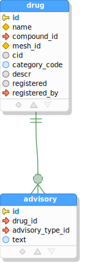
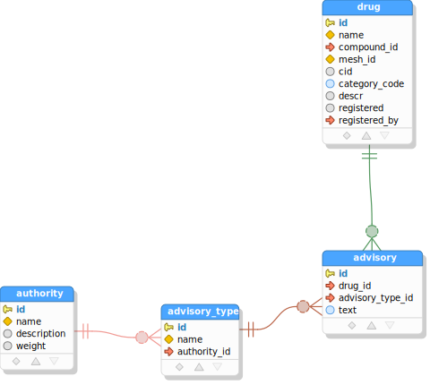

# SQL/JSON-Query TUTORIAL

## Prerequisites
- [NodeJS 14+](https://nodejs.org/en/)
- [Java JDK 11+](https://jdk.java.net) &dagger;
- [Apache Maven 3.6+](https://maven.apache.org/download.cgi) &dagger;

Make sure that Maven's `mvn` is on your path and `JAVA_HOME` is defined to point to your JDK11+
installation directory. From the node installation, `npm` needs to be on your path as well.

&dagger; NOTE: The Java and Maven dependencies can be dispensed with, if you arrange other means of executing
the [database metadata query](https://github.com/scharris/sqljson-query-dropin/tree/main/dbmd/src/main/resources)
for your database type and the saving of its results to `query-gen/dbmd/dbmd.json`. The query has one parameter
`relPat` which is a regular expression for table names to be included (you can pass '.*' or adjust to suit).
The Maven project simply executes this query with a default for `relPat` and saves the results to file.

## Project Directory Setup

Let's create a directory for our query generation experiments.
```console
mkdir sjq-example
cd sjq-example
```

Now we will install the query-generator by cloning the "sqljson-query-dropin" repository, and
initialize it via `npm`:

```console
git clone https://github.com/scharris/sqljson-query-dropin.git query-gen

(cd query-gen && npm i)
```

Here we've installed the query generator in subdirectory `query-gen`, but it can be put anywhere,
so long as commands below are adjusted accordingly.

## Database Setup

Follow the directions in [database setup](tutorial-database-setup.md), to setup a local Postgres database for
use in this tutorial.

## Generate Database Metadata

Now that the database is created and SQL/JSON-Query installed, we can generate our database metadata
via the following Maven command:

```console
mvn -f query-gen/dbmd/pom.xml compile exec:java -DjdbcProps=jdbc.props -Ddb=pg
```

As noted above, it's also easy to generate the database metadata without relying on Maven or Java, if you
will just execute the
[database metadata query](https://github.com/scharris/sqljson-query-dropin/tree/main/dbmd/src/main/resources)
for your database type (Oracle or Postgres) and save the resulting json value to file
`query-gen/dbmd/dbmd.json`. The query has one parameter `relPat` which is a regular expression for table
names to be included, for which you can pass '.*' or adjust it as required.

The metadata is generated at `query-gen/dbmd/dbmd.json`, which is where it's expected to be for the
query generator. It's good to glance at its contents when you're getting started just to make sure
that the tool found the tables and views you expected it to.

## Query Generation

We're now ready to write our query specifications and to generate the SQL and result types sources from them.

## Single-Table Query
We're expected to define our queries in file `query-gen/queries/query-specs.ts`. Create the file in a text editor
with the following initial contents:

```typescript
import {QueryGroupSpec, QuerySpec, RecordCondition} from 'sqljson-query';

const drugsQuery1: QuerySpec = {
  queryName: 'drugs query 1',
  tableJson: {
     table: 'drug',
     recordCondition: { sql: 'category_code = :catCode', paramNames: ['catCode'] },
     fieldExpressions: [
        { field: 'name', jsonProperty: 'drugName' },
        'category_code', // short for: { field: 'category_code', jsonProperty: 'categoryCode' }
        { expression: '$$.cid + 1000',
          jsonProperty: 'cidPlus1000',
          fieldTypeInGeneratedSource: {TS: 'number | null', Java: '@Nullable Long'} },
     ],
  }
};

export const queryGroupSpec: QueryGroupSpec = {
   defaultSchema: 'public',
   generateUnqualifiedNamesForSchemas: [ 'public' ],
   propertyNameDefault: 'CAMELCASE',
   querySpecs: [
      drugsQuery1,
   ]
};
``` 

Here the first definition, `drugsQuery1` is our first query and is of type `QuerySpec`. The lower definition
represents the total set of queries and is the only export for the module. It contains the list of queries to
generate in `querySpecs`, which is just `drugsQuery1` at present. It also specifies some options that apply to
all queries such as the default schema name to be assumed for unqualified tables.


In `drugsQuery1` we've defined a simple query based on just a single table, `drug`. It's given a name via
`queryName` which is used to determine the names of the generated SQL files and TypeScript/Java source files.
The rest of the query specification lies in the `tableJson` property, which describes how to form JSON output
for a given "top" table and whatever related tables it may want to include in its output.

Let's briefly go over the properties of the `tableJson` object, since it's the centerpiece of our query.

```typescript
tableJson: {
  table: 'drug',
  recordCondition: { sql: 'category_code = :catCode', paramNames: ['catCode'] },
  fieldExpressions: [
    { field: 'name', jsonProperty: 'drugName' },
    'category_code', // short for: { field: 'category_code', jsonProperty: 'categoryCode' }
    { expression: '$$.cid + 1000',
      jsonProperty: 'cidPlus1000',
      fieldTypeInGeneratedSource: {TS: 'number | null', Java: '@Nullable Long'} },
  ],
}
```

- The `table` property specifies the top (and here the only) table in this JSON output, which is table `drug`.


- The `recordCondition` is present to filter the rows of our "drug" table, which can be an arbitrary SQL predicate,
basically anything suitable for a WHERE clause. Here we're restricting results by `category_code` value, and using
a SQL parameter named `catCode` as part of the predicate expression. You can use whatever notation is needed
by your SQL execution runtime to indicate parameters.  The `paramNames` property is not required, but if it is
provided then a constant will be defined in the TypeScript or Java source code for each parameter entered here
with value equal to the parameter name, to help catch errors involving using wrong parameter names.


- Finally, the `fieldExpressions` property lists the fields and expressions involving the fields from `table` which
to be included as properties in the JSON objects representing the table rows. The field expressions take three
forms here, which cover all possibilities:

  - The first item shows the general form for a simple table field:
    ```typescript
    { field: 'name', jsonProperty: 'drugName' }
    ```
    In this case the source database table field and desired JSON property name are both given explicitly.
  - The second form ('category_code') is simply a string which is the database field name, in which case the JSON
    property name is automatically set to the camelcase form of the given name ('categoryCode'), because of our
    choice of "propertyNameDefault: 'CAMELCASE'" in the query group specification. Another option is 'AS_IN_DB'
    which would have property names defaulting to the database field names verbatim.
    Thus the `'category_code'` entry is equivalent to:
    ```typescript
    { field: 'category_code', jsonProperty: 'categoryCode' }
    ```
  - The third and final entry is a general expression involving database fields:
    ```typescript
    { expression: '$$.cid + 1000',
      jsonProperty: 'cidPlus1000',
      fieldTypeInGeneratedSource: {TS: 'number | null', Java: '@Nullable Long'} }
    ```
  In this case `expression` is provided instead of `field` (these two are mutually exclusive), and the `jsonProperty`
  and `fieldTypeInGeneratedSource` properties are *required* for expressions, to tell the tool how to name the
  expression and what type its values should be given in result types, by target language. With this form of field
  expression you should be able to represent any sort of expression that is suitable to include as a column value
  in a SQL `SELECT` clause. The syntax `$$` shown in the example expression can be used to qualify the table's
  fields, though it is usually not necessary. Any occurrences of `$$` will be replaced with the alias generated
  for the current table by the query generator.

The `tableJson` object must conform to the `TableJsonSpec` interface, which is described in more detail in the
[TableJsonSpec](query-specifications.md#table-json-specification) documentation. This structure is one of the most
important structures to understand, because it is also the base interface for describing contributions from related
parent and child tables to the JSON output.

So that describes our first query on the `drug` table. Before we generate the SQL and TypeScript sources for it,
let's make source directories to hold our generated sources:
```console
mkdir -p src/sql src/ts
```

Now we can generate the SQL and TypeScript sources as follows:

```console
npm run --prefix query-gen generate-queries -- --sqlDir=../src/sql --tsQueriesDir=../src/ts --tsRelMdsDir=../src/ts
```

If you open the generated SQL file at `src/sql/drugs-query-1.sql`, you should see something like:
```sql
select
  -- row object for table 'drug'
  jsonb_build_object(
    'drugName', q."drugName",
    'categoryCode', q."categoryCode",
    'cidPlus1000', q."cidPlus1000"
  ) json
from (
  -- base query for table 'drug'
  select
    d.name "drugName",
    d.category_code "categoryCode",
    d.cid + 1000 "cidPlus1000"
  from
    drug d
  where (
    (category_code = :catCode)
  )
) q
```  

If we try executing the query in psql, supplying the value 'A' for parameter `catCode`, we should 
see output like the following:
```json lines
{"drugName": "Test Drug 2", "cidPlus1000": 1198, "categoryCode": "A"}
{"drugName": "Test Drug 4", "cidPlus1000": 1396, "categoryCode": "A"}
```

Also a TypeScript module was generated, at `src/ts/drugs-query-1.ts` with contents similar to:
```typescript
// The types defined in this file correspond to results of the following generated SQL queries.
export const sqlResource = "drugs-query-1.sql";

// query parameters
export const catCodeParam = 'catCode';

// Below are types representing the result data for the generated query, with top-level type first.
export interface Drug
{
  drugName: string;
  categoryCode: string;
  cidPlus1000: number | null;
}
```
This TypeScript module defines an interface `Drug` which matches the form of the result objects in the
query results. It also defines a constant for the parameter name as a convenience/safety feature, and
lets you know the corresponding SQL file that was generated as well.

## Adding Parent Tables


The single-table query above lacks information about the compound found in each drug (we're assuming
a drug can only have one such compound in  this example schema). So let's make a new query adding this
information from the `compound` table. The `compound` table is a parent table of our top table `drug`.

Similarly, we'll also add information about the registering analyst for each drug, from the `analyst`
parent table of drug.

We add references to parent tables via the optional property `parentTables` within our `tableJson` object.
Each entry in `parentTables` is itself a structure like that in `tableJson` &mdash; in other words it is a
[TableJsonSpec](query-specifications.md#table-json-specification). It also supports a few additional
properties to control the join mechanism between parent and child. See the
[Parent Table Specification](query-specifications.md#parent-table-specification) documentation for full details.

Now let's proceed to make a copy of our previous query and assign it to `drugsQuery2`, with a new parent tables
section added as follows:

```typescript
const drugsQuery2: QuerySpec = {
   queryName: 'drugs query 2',
   tableJson: {
      table: 'drug',
      recordCondition: { sql: 'category_code = :catCode', paramNames: ['catCode'] },
      fieldExpressions: [
         { field: 'name', jsonProperty: 'drugName' },
         'category_code',
      ],
      // (Added) -->
      parentTables: [
         {
            referenceName: 'primaryCompound',
            table: 'compound',
            fieldExpressions: [
               { field: 'id', jsonProperty: 'compoundId' },
               { field: 'display_name', jsonProperty: 'compoundDisplayName' },
            ],
         },
         {
            // No "referenceName" property specified here => "inline" the properties from this parent.
            table: 'analyst',
            fieldExpressions: [
               { field: 'short_name', jsonProperty: 'registeredByAnalyst' },
            ],
         }
      ],
     // <-- (Added)
   }
};
```

Here we've added the `parentTables` array property with entries for the `compound` and `analyst` tables.
The contents of the parent entries should be familiar because they're mostly the same as would appear
in the top-level `tableJson`. We have a `table` property specifying the parent table name, and
`fieldExpressions` controlling which fields to include in its JSON output.

The only new property here is `referenceName`, which gives a name for the property within the child `drug`
object that references the parent `compound` object. The `referenceName` property is *optional*. If it
were omitted for `compound`, then the fields from `compound` would be included as properties *inlined*
among the fields/expressions coming directly from the child table `drug` - i.e. without a wrapping object
property. The registering analyst information is inlined here, because its entry does not specify a
`referenceName`.

Don't forget to add `drugsQuery2` to the query group representing the queries to be generated:

```typescript
export const queryGroupSpec: QueryGroupSpec = {
   // ...
   querySpecs: [
      drugsQuery1,
      drugsQuery2, // <-- (added)
   ]
};
```

Now let's again generate the SQL and TypeScript sources with the same command as before:

```console
npm run --prefix query-gen generate-queries -- --sqlDir=../src/sql --tsQueriesDir=../src/ts --tsRelMdsDir=../src/ts
```

You can examine the generated SQL for our new query at `src/sql/drugs-query-2.sql`. Basically it has added a new
subquery projecting a `json_build_object()` expression from within the `SELECT` clause of what was our original
drugs query. You will also find the additional `Compound` results structure defined in the corresponding result
types definition module at `src/ts/drugs-query-2.ts`:

```typescript
export interface Compound
{
  compoundId: number;
  compoundDisplayName: string | null;
}
```

If we run the query (with 'A' for parameter `catCode`), we'll see result row values like the following:
```json
{
  "drugName": "Test Drug 2",
  "categoryCode": "A",
  "primaryCompound": {
    "compoundId": 2,
    "compoundDisplayName": "Test Compound 2"
  },
  "registeredByAnalyst": "sch"
}
```
We see our compound information has been added in property `primaryCompound` as expected, and the registering
analyst is represented in the string valued property `registeredByAnalyst`.  Notice that the registering analyst
information does not have a wrapping object (it is "inlined"), because `referenceName` was omitted in its
parent table entry.

## Adding Parent Tables with Explicit Foreign Keys


We've got basic information from the `compound` table in our results now, but `compound` itself references
interesting information in its *own* parent table, `analyst`, which we'd also like to include in our results.
As mentioned earlier, a parent (or child) entry such as our `parentCompound` entry in `parentTables` can have
its own parent or child table entries, so we can just nest a `parentTables` property there to pull in
information from `analyst`.

The only wrinkle in this plan is that there are *two* ways that table `compound` references table `analyst`,
via two different foreign keys: one for the data-entering analyst, and another for the approving analyst. So we
just have to be specific about the foreign key to use when pulling in analyst information. We'll assume that we
want information for both analysts wherever available (though including just one or the other would be fine as
well, but would need the same disambiguation to be provided).

Add a new query by copying the previous one and adding a *nested* `parentTables` property within the
`primaryCompound` entry:

```typescript
const drugsQuery3: QuerySpec = {
   queryName: 'drugs query 3',
   tableJson: {
      table: 'drug',
      recordCondition: { sql: 'category_code = :catCode', paramNames: ['catCode'] },
      fieldExpressions: [
         { field: 'name', jsonProperty: 'drugName' },
         'category_code',
      ],
      parentTables: [
         {
            referenceName: 'primaryCompound',
            table: 'compound',
            fieldExpressions: [
               { field: 'id', jsonProperty: 'compoundId' },
               { field: 'display_name', jsonProperty: 'compoundDisplayName' },
            ],
            // (Added) -->
            parentTables: [
               {
                  table: 'analyst',
                  fieldExpressions: [
                     { field: 'short_name', jsonProperty: 'enteredByAnalyst' }
                  ],
                  viaForeignKeyFields: ['entered_by'] // <- select one of two foreign keys to analyst
               },
               {
                  table: 'analyst',
                  fieldExpressions: [
                     { field: 'short_name', jsonProperty: 'approvedByAnalyst' }
                  ],
                  viaForeignKeyFields: ['approved_by'] // <- select one of two foreign keys to analyst
               }
            ]
            // <-- (Added)
         },
         {
            table: 'analyst',
            fieldExpressions: [
               { field: 'short_name', jsonProperty: 'registeredByAnalyst' },
            ],
         }
      ],
   }
};
```

Now we've added two analyst name properties within the `primaryCompound` entries, while guiding the query
generator to use the appropriate foreign key for each by specifying the foreign key fields in
`viaForeignKeyFields` in each instance. Specifying the foreign key fields like this is always necessary
whenever more than one foreign key constraint exists between the two tables in the direction in context.

Also note that we did not specify a `referenceName` for either of the `analyst` parent table entries, which
means that the field expressions `enteredByAnalyst` and `approvedByAnalyst` will be included inline among the
fields from `compound` itself.

Add the new query to the exported `queryGroupSpec` as always, and regenerate the query SQL and sources as before:

```console
npm run --prefix query-gen generate-queries -- --sqlDir=../src/sql --tsQueriesDir=../src/ts --tsRelMdsDir=../src/ts
```

In the result type declaration module `src/ts/drugs-query-3.ts`, we see that our two analyst fields have been added to
the `Compound` result interface:

```typescript
export interface Compound
{
  compoundId: number;
  compoundDisplayName: string | null;
  enteredByAnalyst: string;
  approvedByAnalyst: string | null;
}
```

Note that nullability has been correctly inferred for the fields, based both on the field nullability in the parent
table (`short_name` being non-nullable in this case), but also on the nullability of the referencing foreign key
(only non-nullable for the entering analyst).

Our SQL at `src/sql/drugs-query-3.sql` has gotten more complex as expected. Running this query with 'A' for `catCode`,
we see output like the following in each result row, which contains our two analysts with each compound:

```json
{
  "drugName": "Test Drug 2",
  "categoryCode": "A",
  "primaryCompound": {
    "compoundId": 2,
    "enteredByAnalyst": "jdoe",
    "approvedByAnalyst": "sch",
    "compoundDisplayName": "Test Compound 2"
  },
  "registeredByAnalyst": "sch"
}
```

That covers the main points for obtaining data from parent tables. For more information see the
[Parent Table Specification](query-specifications.md#parent-table-specification) documentation.

## Adding a Child Collection



Next we'll add a collection of related advisories for the drugs. The `advisory` table is a child table of table
`drug` as seen in the diagram. We want a collection property which collects for each drug the list of related
advisories. Child table collection properties are described in the optional property `childTables` within the
`tableJson`. Each entry in `childTables` can specify any of the properties allowed in `tableJson` as described
above, to control the translation of the child table's content to JSON &mdash; in other words a `childTables`
entry is a [TableJsonSpec](query-specifications.md#table-json-specification). It also allows a few additional
properties: a `collectionName` property to name the collection member, and a few optional properties related
to customizing or disambiguating the join between parent and child, which are needed only infrequently.
See the [Child Table Specification](query-specifications.md#child-table-specification) documentation for full
details.

To add the drug advisories data, add a new query based on the previous one which adds a new `childTables` section
within `tableJson` as follows:

```typescript
const drugsQuery4: QuerySpec = {
   queryName: 'drugs query 4',
   tableJson: {
      table: 'drug',
      recordCondition: { sql: 'category_code = :catCode', paramNames: ['catCode'] },
      fieldExpressions: [
         { field: 'name', jsonProperty: 'drugName' },
         'category_code',
      ],
      parentTables: [
         {
            referenceName: 'primaryCompound',
            table: 'compound',
            fieldExpressions: [
               { field: 'id', jsonProperty: 'compoundId' },
               { field: 'display_name', jsonProperty: 'compoundDisplayName' },
            ],
            parentTables: [
               {
                  table: 'analyst',
                  fieldExpressions: [
                     { field: 'short_name', jsonProperty: 'enteredByAnalyst' }
                  ],
                  viaForeignKeyFields: ['entered_by']
               },
               {
                  table: 'analyst',
                  fieldExpressions: [
                     { field: 'short_name', jsonProperty: 'approvedByAnalyst' }
                  ],
                  viaForeignKeyFields: ['approved_by']
               }
            ]
         },
         {
            table: 'analyst',
            fieldExpressions: [
               { field: 'short_name', jsonProperty: 'registeredByAnalyst' },
            ],
         }
      ],
      // (Added) -->
      childTables: [
         {
            collectionName: 'advisories',
            table: 'advisory',
            fieldExpressions: [
               'advisory_type_id',
               { field: 'text', jsonProperty: 'advisoryText' },
            ]
         }
      ],
      // <-- (Added)
   }
};
```

Add `drugsQuery4` to `queryGroupSpec` and run the sources generator with our usual command:

```console
npm run --prefix query-gen generate-queries -- --sqlDir=../src/sql --tsQueriesDir=../src/ts --tsRelMdsDir=../src/ts
```

If you examine the generated result types module for the query at `src/ts/drugs-query-4.ts`, you should see a new
`advisories` property of type `Advisory[]` within the `Drug` type, as well as a definition for the `Advisory` type
itself.

Try running the SQL at `src/sql/drugs-query-4.sql` with 'A' for `catCode`, and verify that the query produces an 
array of drug advisories. The json value in each row should look like:
```json
{
  "drugName": "Test Drug 2",
  "advisories": [
    {
      "advisoryText": "Advisory concerning drug 2",
      "advisoryTypeId": 1
    },
    {
      "advisoryText": "Caution concerning drug 2",
      "advisoryTypeId": 2
    },
    {
      "advisoryText": "Heard this might be bad -anon2",
      "advisoryTypeId": 3
    }
  ],
  "categoryCode": "A",
  "primaryCompound": {
    "compoundId": 2,
    "enteredByAnalyst": "jdoe",
    "approvedByAnalyst": "sch",
    "compoundDisplayName": "Test Compound 2"
  },
  "registeredByAnalyst": "sch"
}
```

## Pulling Fields through Multiple Parents



With our advisories added above, it would be helpful if we included details from `advisory_type` with
each advisory, and better still if we also had data from `advisory_type`'s own parent table `authority`.
Since the entries of `childTables` and `parentTables` conform to
the [TableJsonSpec](query-specifications.md#table-json-specification) interface, they support arbitrary
nesting of parent and child tables, and we can achieve our desired result by nesting.

Our strategy is first to add `advisory_type` as a parent table within the `advisory` entry. Then we will
add `authority` as a parent table within the `advisory_type` entry.

We will also include each added parent as "inlined", by not giving a reference property name, so the parent's
fields will be inlined among the fields of its child table without wrapping the parent data in an unnecessary
object wrapper.

<hr>
<hr>
<hr>

Make a modified copy of the previous query and assign it to `drugsQuery5` as follows, to add information from
`advisory_type` and `authority` within each `advisory`:

```typescript
const drugsQuery5: QuerySpec = {
   queryName: 'drugs query 5',
   tableJson: {
      table: 'drug',
      recordCondition: { sql: 'category_code = :catCode', paramNames: ['catCode'] },
      fieldExpressions: [
         { field: 'name', jsonProperty: 'drugName' },
         'category_code',
      ],
      parentTables: [
         {
            referenceName: 'primaryCompound',
            table: 'compound',
            fieldExpressions: [
               { field: 'id', jsonProperty: 'compoundId' },
               { field: 'display_name', jsonProperty: 'compoundDisplayName' },
            ],
            parentTables: [
               {
                  table: 'analyst',
                  fieldExpressions: [
                     { field: 'short_name', jsonProperty: 'enteredByAnalyst' }
                  ],
                  viaForeignKeyFields: ['entered_by']
               },
               {
                  table: 'analyst',
                  fieldExpressions: [
                     { field: 'short_name', jsonProperty: 'approvedByAnalyst' }
                  ],
                  viaForeignKeyFields: ['approved_by']
               }
            ]
         },
         {
            table: 'analyst',
            fieldExpressions: [
               { field: 'short_name', jsonProperty: 'registeredByAnalyst' },
            ],
         }
      ],
      childTables: [
         {
            collectionName: 'advisories',
            table: 'advisory',
            fieldExpressions: [
               'advisory_type_id',
               { field: 'text', jsonProperty: 'advisoryText' },
            ],
            // (Added) -->
            parentTables: [
               {
                  table: 'advisory_type',
                  fieldExpressions: [ { field: 'name', jsonProperty: 'advisoryTypeName' } ],
                  parentTables: [
                     {
                        table: 'authority',
                        fieldExpressions: [ { field: 'name', jsonProperty: 'advisoryTypeAuthorityName' } ]
                     }
                  ]
               }
            ]
            // <-- (Added)
         }
      ]
   }
};
```

Add the new `drugsQuery5` query to the exported `queryGroupSpec`, and regenerate the query SQL and sources again:

```console
npm run --prefix query-gen generate-queries -- --sqlDir=../src/sql --tsQueriesDir=../src/ts --tsRelMdsDir=../src/ts
```

In the generated result types module for the query at `src/ts/drugs-query-5.ts`, we should see new fields for the
advisory type name and authority name. These were pulled from the advisory table's parent, and from the parent of
its parent, respectively. By using this technique we can pull fields through any number of parent associations.

```typescript
export interface Advisory
{
  advisoryTypeId: number;
  advisoryText: string;
  advisoryTypeName: string;
  advisoryTypeAuthorityName: string;
}
```

Running the SQL at `src/sql/drugs-query-5.sql`, we should see advisory the additional information in each
advisory entry.

## Including Data from Many-Many Relationships

We've discussed above the handling of relationships with parent tables (many to one), and with child tables
(one to many), but nothing yet about how to include data through many-to-many relationships.


It turns out we don't need any new constructs to handle this case. We can include data from the far side of
a many-many relationship by first including the intersection table as a direct child table of our starting
table, and then including the far side table as an inlined parent within that intersection table entry.

As an example let's add data from the `reference` table (representing bibliographic references) to our
drugs data. We will include within each drug a collection of the drug's references, also including the
priority of each reference particular to the drug from the intermediate table. We'll also sort the
references collections by priority.

Make a modified copy of the previous query and assign to `drugsQuery6`, which will be our final query, as follows:

### Final Query

```typescript
const drugsQuery6: QuerySpec = {
   queryName: 'drugs query 6',
   tableJson: {
      table: 'drug',
      recordCondition: { sql: 'category_code = :catCode', paramNames: ['catCode'] },
      fieldExpressions: [
         { field: 'name', jsonProperty: 'drugName' },
         'category_code',
      ],
      parentTables: [
         {
            referenceName: 'primaryCompound',
            table: 'compound',
            fieldExpressions: [
               { field: 'id', jsonProperty: 'compoundId' },
               { field: 'display_name', jsonProperty: 'compoundDisplayName' },
            ],
            parentTables: [
               {
                  table: 'analyst',
                  fieldExpressions: [
                     { field: 'short_name', jsonProperty: 'enteredByAnalyst' }
                  ],
                  viaForeignKeyFields: ['entered_by'] // <- select on of two foreign keys to analyst
               },
               {
                  table: 'analyst',
                  fieldExpressions: [
                     { field: 'short_name', jsonProperty: 'approvedByAnalyst' }
                  ],
                  viaForeignKeyFields: ['approved_by'] // <- select one of two foreign keys to analyst
               }
            ]
         },
         {
            table: 'analyst',
            fieldExpressions: [
               { field: 'short_name', jsonProperty: 'registeredByAnalyst' },
            ],
         }
      ],
      childTables: [
         {
            collectionName: 'advisories',
            table: 'advisory',
            fieldExpressions: [
               'advisory_type_id',
               { field: 'text', jsonProperty: 'advisoryText' },
            ],
            parentTables: [
               {
                  table: 'advisory_type',
                  fieldExpressions: [ { field: 'name', jsonProperty: 'advisoryTypeName' } ],
                  parentTables: [
                     {
                        table: 'authority',
                        fieldExpressions: [ { field: 'name', jsonProperty: 'advisoryTypeAuthorityName' } ]
                     }
                  ]
               }
            ]
         },
         // (Added) -->
         {
            collectionName: 'prioritizedReferences',
            table: 'drug_reference',
            fieldExpressions: [ 'priority' ],
            parentTables: [
               {
                  table: "reference",
                  fieldExpressions: [ 'publication' ]
               }
            ],
            orderBy: 'priority asc'
         }
         // <-- (Added)
      ]
   }
};
```

We already had a `childTables` property in our `drug` specification from previous queries (for advisories),
so we've just added another entry for our intersection table `drug_reference` in the same array. We project
the `priority` column of the intersection table into the results via its `fieldExpressions`, though it is
not required to project anything from the intersection table in general. Then within that same `drug_reference`
entry, we add `reference` as a parent table, without specifying a `referenceName` property. That way
its projected fields (just `publication` here) are included inline within the `drug_reference` object data,
ie. as a sibling to any properties that might be included from the intersection table.

Note that we're pulling data from independent child tables in a single query, which is a source of difficulty
for purely join-based approaches (those that don't employ aggregation functions), which would generally have
to perform multiple queries to get the same data.

Add the `drugsQuery6` query to the exported `queryGroupSpec`, and regenerate the query SQL and sources as before:

```console
npm run --prefix query-gen generate-queries -- --sqlDir=../src/sql --tsQueriesDir=../src/ts --tsRelMdsDir=../src/ts
```

## Final Query Review

Let's review what's been accomplished with the [final query specification](#final-query) above. 

The query includes data from each of the following related tables using all of the foreign keys shown:


From the query specification above, a SQL query is generated at `src/sql/drugs-query-6.sql`, which includes
data from all of the above tables:

```sql
select
  -- row object for table 'drug'
  jsonb_build_object(
    'drugName', q."drugName",
    'categoryCode', q."categoryCode",
    'registeredByAnalyst', q."registeredByAnalyst",
    'primaryCompound', q."primaryCompound",
    'advisories', q.advisories,
    'prioritizedReferences', q."prioritizedReferences"
  ) json
from (
  -- base query for table 'drug'
  select
    d.name "drugName",
    d.category_code "categoryCode",
    -- field(s) inlined from parent table 'analyst'
    q."registeredByAnalyst" "registeredByAnalyst",
    -- parent table 'compound' referenced as 'primaryCompound'
    (
      select
        -- row object for table 'compound'
        jsonb_build_object(
          'compoundId', q."compoundId",
          'compoundDisplayName', q."compoundDisplayName",
          'enteredByAnalyst', q."enteredByAnalyst",
          'approvedByAnalyst', q."approvedByAnalyst"
        ) json
      from (
        -- base query for table 'compound'
        select
          c.id "compoundId",
          c.display_name "compoundDisplayName",
          -- field(s) inlined from parent table 'analyst'
          q."enteredByAnalyst" "enteredByAnalyst",
          -- field(s) inlined from parent table 'analyst'
          q1."approvedByAnalyst" "approvedByAnalyst"
        from
          compound c
          -- parent table 'analyst', joined for inlined fields
          left join (
            select
              a.id "_id",
              a.short_name "enteredByAnalyst"
            from
              analyst a
          ) q on c.entered_by = q."_id"
          -- parent table 'analyst', joined for inlined fields
          left join (
            select
              a.id "_id",
              a.short_name "approvedByAnalyst"
            from
              analyst a
          ) q1 on c.approved_by = q1."_id"
        where (
          d.compound_id = c.id
        )
      ) q
    ) "primaryCompound",
    -- records from child table 'advisory' as collection 'advisories'
    (
      select
        -- aggregated row objects for table 'advisory'
        coalesce(jsonb_agg(jsonb_build_object(
          'advisoryTypeId', q."advisoryTypeId",
          'advisoryText', q."advisoryText",
          'advisoryTypeName', q."advisoryTypeName",
          'advisoryTypeAuthorityName', q."advisoryTypeAuthorityName"
        )),'[]'::jsonb) json
      from (
        -- base query for table 'advisory'
        select
          a.advisory_type_id "advisoryTypeId",
          a.text "advisoryText",
          -- field(s) inlined from parent table 'advisory_type'
          q."advisoryTypeName" "advisoryTypeName",
          q."advisoryTypeAuthorityName" "advisoryTypeAuthorityName"
        from
          advisory a
          -- parent table 'advisory_type', joined for inlined fields
          left join (
            select
              at.id "_id",
              at.name "advisoryTypeName",
              -- field(s) inlined from parent table 'authority'
              q."advisoryTypeAuthorityName" "advisoryTypeAuthorityName"
            from
              advisory_type at
              -- parent table 'authority', joined for inlined fields
              left join (
                select
                  a.id "_id",
                  a.name "advisoryTypeAuthorityName"
                from
                  authority a
              ) q on at.authority_id = q."_id"
          ) q on a.advisory_type_id = q."_id"
        where (
          a.drug_id = d.id
        )
      ) q
    ) as advisories,
    -- records from child table 'drug_reference' as collection 'prioritizedReferences'
    (
      select
        -- aggregated row objects for table 'drug_reference'
        coalesce(jsonb_agg(jsonb_build_object(
          'priority', q.priority,
          'publication', q.publication
        ) order by priority asc),'[]'::jsonb) json
      from (
        -- base query for table 'drug_reference'
        select
          dr.priority as priority,
          -- field(s) inlined from parent table 'reference'
          q.publication as publication
        from
          drug_reference dr
          -- parent table 'reference', joined for inlined fields
          left join (
            select
              r.id "_id",
              r.publication as publication
            from
              reference r
          ) q on dr.reference_id = q."_id"
        where (
          dr.drug_id = d.id
        )
      ) q
    ) "prioritizedReferences"
  from
    drug d
    -- parent table 'analyst', joined for inlined fields
    left join (
      select
        a.id "_id",
        a.short_name "registeredByAnalyst"
      from
        analyst a
    ) q on d.registered_by = q."_id"
  where (
    (category_code = :catCode)
  )
) q
```

Also generated is a TypeScript result types module `src/ts/drugs-query-6.ts`, to represent the types in the query
result set:

```typescript
// The types defined in this file correspond to results of the following generated SQL queries.
export const sqlResource = "drugs-query-6.sql";


// query parameters
export const catCodeParam = 'catCode';

// Below are types representing the result data for the generated query, with top-level type first.
export interface Drug
{
  drugName: string;
  categoryCode: string;
  registeredByAnalyst: string;
  primaryCompound: Compound;
  advisories: Advisory[];
  prioritizedReferences: DrugReference[];
}

export interface Compound
{
  compoundId: number;
  compoundDisplayName: string | null;
  enteredByAnalyst: string;
  approvedByAnalyst: string | null;
}

export interface Advisory
{
  advisoryTypeId: number;
  advisoryText: string;
  advisoryTypeName: string;
  advisoryTypeAuthorityName: string;
}

export interface DrugReference
{
  priority: number | null;
  publication: string;
}
```

When run, the SQL query results in values like the following from one of the result rows:

```json
{
  "drugName": "Test Drug 2",
  "advisories": [
    {
      "advisoryText": "Advisory concerning drug 2",
      "advisoryTypeId": 1,
      "advisoryTypeName": "Boxed Warning",
      "advisoryTypeAuthorityName": "FDA"
    },
    {
      "advisoryText": "Caution concerning drug 2",
      "advisoryTypeId": 2,
      "advisoryTypeName": "Caution",
      "advisoryTypeAuthorityName": "FDA"
    },
    {
      "advisoryText": "Heard this might be bad -anon2",
      "advisoryTypeId": 3,
      "advisoryTypeName": "Rumor",
      "advisoryTypeAuthorityName": "Anonymous"
    }
  ],
  "categoryCode": "A",
  "primaryCompound": {
    "compoundId": 2,
    "enteredByAnalyst": "jdoe",
    "approvedByAnalyst": "sch",
    "compoundDisplayName": "Test Compound 2"
  },
  "registeredByAnalyst": "sch",
  "prioritizedReferences": [
    {
      "priority": 2,
      "publication": "Publication 1 about drug # 2"
    },
    {
      "priority": 2,
      "publication": "Publication 2 about drug # 2"
    },
    {
      "priority": 2,
      "publication": "Publication 3 about drug # 2"
    }
  ]
}
```

That concludes this tutorial. For more in depth information about building query specifications, 
see the [query specifications](query-specifications.md) documentation.
